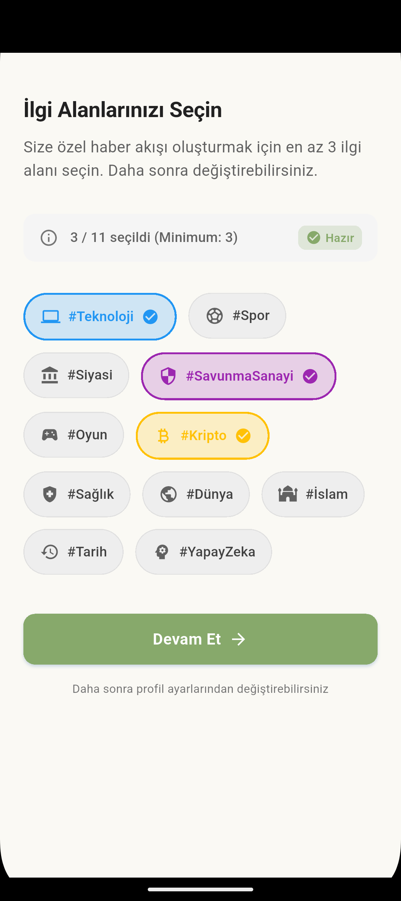

# Haber Merkezi - RSS Tabanlı Haber Uygulaması

Modern Flutter ile geliştirilmiş, Clean Architecture + Riverpod tabanlı kapsamlı haber uygulaması.

<p align="center">
  
  
  
  <a href="https://github.com/caymazyusuf72/habermerkezim/releases/latest">
    
  </a>
  <a href="https://github.com/caymazyusuf72/habermerkezim/actions/workflows/ci.yml">
    
  </a>
  <a href="https://github.com/caymazyusuf72/habermerkezim/actions/workflows/release.yml">
    
  </a>
  <a href="https://github.com/caymazyusuf72/habermerkezim/issues">
    
  </a>
  <a href="https://github.com/caymazyusuf72/habermerkezim/stargazers">
    
  </a>
  <a href="https://www.gnu.org/licenses/gpl-3.0">
    
  </a>
</p>

---

## Ekran Görüntüleri

<div align="center">
  
  &nbsp;&nbsp;&nbsp;&nbsp;
  
</div>

---

## Özellikler

### Temel Özellikler
- **RSS Tabanlı İçerik**: Güvenilir haber kaynaklarından otomatik içerik çekimi
- **Modern UI/UX**: Material Design 3 ile modern, kullanıcı dostu arayüz
- **Dark/Light Mode**: Göz yorgunluğunu azaltan karanlık tema + sistem teması algılama
- **Offline Mode**: İnternet bağlantısı olmadan da haberleri görüntüleme
- **Pull-to-Refresh**: Hızlı içerik yenileme
- **Infinite Scroll**: Sayfa sayfa haber yükleme ile performans optimizasyonu
- **Kategori Filtreleme**: Genel, Türkiye, Ekonomi, Teknoloji, Spor kategorileri
- **Gelişmiş Filtreleme**: Tarih aralığı, kaynak, kategori ve okunma durumu filtreleri
- **Gelişmiş Arama**: İçerik içinde arama ve filtreleme
- **Paylaşım**: Haberleri sosyal medyada paylaşma
- **Kaynak Görüntüleme**: Orijinal haberlere doğrudan erişim

### Gelişmiş Özellikler
- **Yer İşaretleri**: Haberleri kaydetme ve koleksiyon oluşturma
- **Okuma İstatistikleri**: Okuma alışkanlıkları takibi ve hedef belirleme
- **Akıllı Bildirimler**: Günlük haber özetleri ve okuma hedefi hatırlatıcıları
- **Metin Okuma (TTS)**: Haberleri sesli dinleme
- **Podcast Desteği**: Haber podcast'leri
- **Gamification**: Okuma rozetleri ve başarı sistemi
- **ML Öneri Sistemi**: Kişiselleştirilmiş haber önerileri
- **Trend Haberler**: Popüler ve trend içerikler
- **Çoklu Dil**: Türkçe ve İngilizce dil desteği (l10n)
- **Firebase Auth**: Google Sign-In ile kullanıcı hesabı *(Not: Açık kaynak sürümünde doğrudan erişim için login ekranı atlanmıştır)*
- **Cloud Sync**: Firestore ile bulut senkronizasyonu

### Performans ve DevOps
- **Performans Monitoring**: Sayfa yükleme ve API response süreleri takibi
- **Görsel Optimizasyonu**: Otomatik boyutlandırma, CDN desteği, cache yönetimi
- **Network Optimizasyonu**: Request debouncing, retry logic, circuit breaker
- **Multi-level Cache**: Memory -> Disk katmanlı cache, LRU eviction, TTL invalidation
- **App Startup Optimizer**: Sıralı servis başlatma, lazy initialization
- **Memory Management**: Image cache temizleme, dispose takibi
- **CI/CD**: GitHub Actions ile otomatik test, analiz ve build

---

## Mimari

### Clean Architecture

```
lib/
├── main.dart                    # Uygulama giriş noktası
├── firebase_options.dart        # Firebase konfigürasyonu
├── core/                        # Temel bileşenler
│   ├── config/                     # Uygulama konfigürasyonu (env)
│   ├── constants/                  # Sabitler (API endpoints, renkler vb.)
│   ├── error/                      # Hata yönetimi (Failure sınıfları)
│   ├── extensions/                 # Extension metotları
│   ├── providers/                  # Global Riverpod provider'lar
│   ├── services/                   # Servisler (44+ servis)
│   ├── theme/                      # Tema yönetimi
│   └── utils/                      # Yardımcı fonksiyonlar
├── data/                        # Veri katmanı
│   ├── datasources/                # Uzak/yerel veri kaynakları
│   ├── models/                     # Veri modelleri (Hive adaptörleri)
│   └── repositories/               # Repository implementasyonları
├── domain/                      # İş mantığı katmanı
│   ├── entities/                   # Entity sınıfları
│   ├── repositories/               # Repository arayüzleri
│   └── usecases/                   # Use case'ler
├── presentation/               # Sunum katmanı
│   ├── pages/                      # Sayfa widget'ları
│   ├── providers/                  # UI state provider'ları
│   ├── theme/                      # Tema verileri
│   └── widgets/                    # Tekrar kullanılabilir widget'lar
└── l10n/                       # Lokalizasyon dosyaları
```

### Katmanlar Arası İletişim

```
┌──────────────┐     ┌──────────────┐     ┌──────────────┐
│ Presentation │ ──▶ │   Domain     │ ◀── │    Data      │
│   (UI/State) │     │ (Use Cases)  │     │ (Repository) │
└──────────────┘     └──────────────┘     └──────────────┘
       │                    │                     │
   Riverpod            Entities              Models/API
   Providers           Interfaces            Hive/Dio
```

---

## Teknoloji Stack

| Kategori | Teknoloji | Versiyon |
|----------|-----------|----------|
| **Framework** | Flutter | 3.8.1+ |
| **Language** | Dart | 3.8.1+ |
| **State Management** | Riverpod | ^2.6.1 |
| **HTTP Client** | Dio | ^5.4.0 |
| **Local Database** | Hive | ^2.2.3 |
| **Cache** | flutter_cache_manager | ^3.4.1 |
| **Firebase** | Core, Auth, Firestore, Crashlytics, Analytics | v3/v5 |
| **Auth** | Google Sign-In | ^6.2.1 |
| **XML/HTML Parsing** | xml, html | ^6.4.2, ^0.15.5 |
| **UI Components** | Material 3, Shimmer, Lottie, Flutter Animate | Latest |
| **Charts** | fl_chart | ^0.69.0 |
| **Audio** | just_audio, audio_service | Latest |
| **Video** | video_player, youtube_player_flutter | Latest |
| **TTS** | flutter_tts | ^4.0.2 |
| **Notifications** | flutter_local_notifications | ^19.5.0 |
| **Security** | flutter_secure_storage, envied | Latest |

---

## Kurulum ve Çalıştırma

### Ön Gereksinimler
- Flutter SDK 3.8.1 veya üstü
- Dart SDK 3.8.1 veya üstü
- Android Studio / VSCode
- Git
- Firebase projesi (opsiyonel - Firebase özellikleri için)

### Adım Adım Kurulum

```bash
# 1. Repository'yi klonlayın
git clone <repository-url>
cd haber-merkezi

# 2. Environment dosyasını oluşturun
cp .env.example .env
# .env dosyasını düzenleyin

# 3. Firebase Kurulumu (ÖNEMLİ)
# Proje açık kaynak olduğu için Firebase config dosyaları projede yer almaz.
# Kendi Firebase projenizi oluşturup indirdiğiniz google-services.json dosyasını android/app/ klasörüne ekleyin.
# Ardından firebase_options.dart dosyasını oluşturmak için flutterfire-cli kullanın:
# flutterfire configure

# 4. Dependencies yükleyin
flutter pub get

# 5. Kod üretimini çalıştırın (Hive adaptörleri, envied vb.)
flutter pub run build_runner build --delete-conflicting-outputs

# 6. Uygulamayı çalıştırın
flutter run
```

### Environment Değişkenleri

`.env.example` dosyasını `.env` olarak kopyalayıp gerekli değişkenleri doldurun:

```env
# API anahtarları ve konfigürasyon
# Detaylar için .env.example dosyasına bakın
```

---

## Build Komutları

### Geliştirme
```bash
# Debug modda çalıştır
flutter run

# Hot reload ile çalıştır
flutter run --hot
```

### Test
```bash
# Tüm testleri çalıştır
flutter test

# Coverage ile çalıştır
flutter test --coverage

# Belirli bir test dosyası
flutter test test/presentation/widgets/error/error_widget_test.dart
```

### Analiz
```bash
# Statik analiz
dart analyze

# Format kontrolü
dart format --set-exit-if-changed lib/

# Format düzeltme
dart format lib/
```

### Production Build
```bash
# Android APK
flutter build apk --release

# Android App Bundle (Play Store için)
flutter build appbundle --release

# Web
flutter build web --release

# iOS (macOS gerekli)
flutter build ios --release
```

---

## Test Stratejisi

### Test Türleri
| Tür | Konum | Açıklama |
|-----|-------|----------|
| **Unit Tests** | `test/` | Entity, model ve servis testleri |
| **Widget Tests** | `test/presentation/` | UI bileşen testleri |
| **Integration Tests** | `integration_test/` | E2E senaryoları |

### Mevcut Testler
- `test/presentation/widgets/error/error_widget_test.dart` — Hata widget testleri
- `test/presentation/widgets/shimmer/shimmer_widget_test.dart` — Shimmer widget testleri

### Test Çalıştırma
```bash
# Tüm testler
flutter test

# Coverage raporu
flutter test --coverage
genhtml coverage/lcov.info -o coverage/html
```

---

## CI/CD Pipeline

### GitHub Actions

**CI Pipeline** (`.github/workflows/ci.yml`):
- **Tetikleyici**: Push (main, develop), Pull Request
- **Analyze**: `dart analyze` + format kontrolü
- **Test**: `flutter test --coverage`
- **Build**: Android APK (sadece main branch)

**Release Pipeline** (`.github/workflows/release.yml`):
- **Tetikleyici**: Tag push (`v*`)
- **Build**: APK + AAB oluşturma
- **Artifact**: Otomatik artifact upload

### Release Oluşturma
```bash
# Versiyon etiketi oluştur
git tag v1.0.0
git push origin v1.0.0
```

---

## Performans Optimizasyonları

| Optimizasyon | Açıklama |
|-------------|----------|
| **Multi-level Cache** | Memory -> Disk katmanlı cache, LRU eviction |
| **Image Optimization** | Ekran boyutuna göre otomatik boyutlandırma, thumbnail URL |
| **Network Optimizer** | Request debouncing, deduplication, exponential backoff |
| **Circuit Breaker** | Hatalı servislere otomatik istek kesme |
| **Performance Monitor** | Sayfa yükleme süresi, API response time tracking |
| **App Startup** | Sıralı servis başlatma, lazy initialization |
| **Memory Management** | Image cache temizleme, dispose takibi |
| **ProGuard** | Android release build boyut optimizasyonu |

---

## Proje Yapısı (Kök Dizin)

```
habermerkezim1/
├── .github/workflows/        # CI/CD pipeline'ları
├── android/                  # Android platform konfigürasyonu
├── assets/                   # Statik dosyalar
├── animation/                # Lottie animasyonları
├── docs/                     # Proje dokümantasyonu
├── lib/                      # Ana kaynak kod
├── plans/                    # Geliştirme planları
├── test/                     # Test dosyaları
├── web/                      # Web platform dosyaları
├── .env.example              # Örnek environment dosyası
├── analysis_options.yaml     # Dart lint kuralları
├── pubspec.yaml              # Proje bağımlılıkları
└── README.md                 # Bu dosya
```

---

## Katkıda Bulunma (Contributing)

Bu proje açık kaynaktır ve her türlü katkıya (hata düzeltmeleri, yeni özellikler, dokümantasyon güncellemeleri) açıktır! Lütfen katkıda bulunmadan önce [CONTRIBUTING.md](CONTRIBUTING.md) dosyasını ve davranış kurallarını inceleyin.

1. Projeyi fork yapın.
2. Yeni özelliğiniz için branch oluşturun (`git checkout -b feature/harika-ozellik`).
3. Değişikliklerinizi commit edin (`git commit -m 'feat: harika bir özellik eklendi'`).
4. Branch'inize push yapın (`git push origin feature/harika-ozellik`).
5. Bir Pull Request açın.

### Commit Mesajı Formatı
```
feat: Yeni özellik ekleme
fix: Hata düzeltme
docs: Dokümantasyon güncelleme
style: Kod formatı değişikliği
refactor: Kod yeniden düzenleme
test: Test ekleme/güncelleme
chore: Build/CI değişiklikleri
perf: Performans iyileştirmesi
```

---

## Lisans

Bu proje **GNU General Public License v3.0 (GPL-3.0)** altında lisanslanmıştır. Herkes özgürce kullanabilir, satabilir ve değiştirebilir ancak değiştirdiğiniz veya üzerine inşa ettiğiniz kodları da aynı açık kaynak lisansıyla (GPL) yayınlamak zorundasınız. Detaylar için [LICENSE](LICENSE) dosyasına bakın.

---

## Sürüm Geçmişi

### v1.1.0 (Güncel)
- Clean Architecture yeniden yapılandırma
- 44+ servis ile kapsamlı özellik seti
- Firebase entegrasyonu (Auth, Firestore, Analytics, Crashlytics)
- Performans optimizasyonları (cache, network, memory)
- CI/CD pipeline (GitHub Actions)
- Strict lint kuralları
- Çoklu dil desteği (l10n)

### v1.0.0
- Temel haber okuma özellikleri
- RSS feed entegrasyonu
- Dark/Light tema
- Offline okuma desteği
- Kategori filtreleme

---

## Gelecek Planları

- [ ] Push notification geliştirmeleri
- [ ] Tablet ve masaüstü optimizasyonu
- [ ] Daha fazla test coverage
- [ ] Accessibility (a11y) iyileştirmeleri
- [ ] App Widget (Android/iOS)

---

**Bu projeyi beğendiyseniz yıldız vermeyi unutmayın!**
