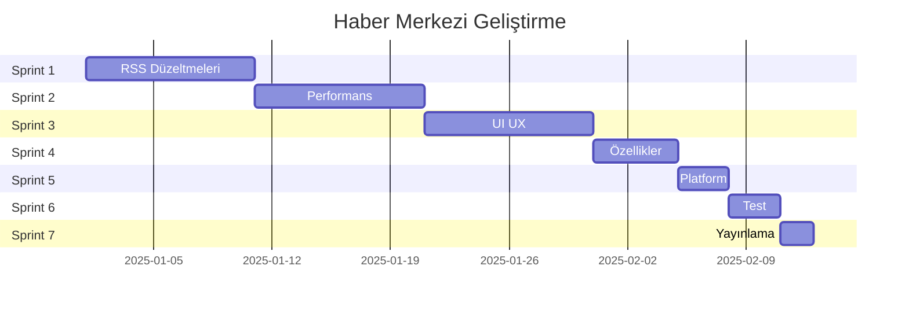

# 🚀 Haber Merkezi - Geliştirme Yol Haritası 2025

**Proje:** Haber Merkezi Flutter Uygulaması  
**Hedef Süre:** 8 hafta (1-2 ay)  
**Ekip:** Tek Geliştirici  
**Odak:** Mevcut sorunları çöz, stabilite artır, yayınlama hazırlığı yap

---

## 📊 Proje Özeti

### Mevcut Durum
- **107 RSS kaynağı** (39 yeni eklendi)
- **12 kategori** haber sunumu
- **2000+ makale** cache
- **Clean Architecture** + Provider/Riverpod
- Android emülatörde **başarıyla çalışıyor**
- RAM: ~312MB, CPU: %0.5

### Ana Hedefler
1. ✅ RSS feed sorunlarını çöz (Sözcü, Milliyet, Dünya Gazetesi)
2. ✅ Performans optimizasyonları
3. ✅ UI/UX iyileştirmeleri
4. ✅ Test coverage artırımı
5. ✅ Play Store yayınlama hazırlığı

### Tespit Edilen RSS Sorunları (Loglardan)
```
❌ turkiye_sozcu: XML parse hatası (HTML döndürüyor)
❌ bilim_evrimagaci: XML parse hatası
❌ saglik_hurriyet: XML parse hatası
❌ spor_fotomac: Redirect loop hatası
❌ teknoloji_tamindir: 404 hatası
```

**Toplam:** 2056 makale başarıyla yüklendi (107 kaynaktan 102'si çalışıyor, %95 başarı oranı)

---

## 🗓️ Sprint Planlaması

### 📅 Sprint 1: Acil Düzeltmeler (Hafta 1-2)
**Süre:** 10 gün | **Öncelik:** 🔴 Yüksek

#### Hedefler
- RSS feed sorunlarını çöz
- Error handling iyileştir
- Kritik hataları düzelt

#### Görevler

**1.1 RSS Kaynaklarını Düzelt**
- [ ] Sözcü RSS alternatif URL bul veya kaldır (XML yerine HTML)
- [ ] Evrim Ağacı RSS düzelt veya kaldır
- [ ] Hürriyet Sağlık RSS düzelt
- [ ] Fotomaç RSS düzelt (redirect loop)
- [ ] Tamindir RSS düzelt veya kaldır (404)
- [ ] api_endpoints.dart güncelle

**1.2 Error Handling**
- [ ] RSS parsing için try-catch iyileştir
- [ ] Kullanıcı dostu hata mesajları ekle
- [ ] Retry mekanizması (3 deneme)
- [ ] Timeout değerlerini optimize et

**1.3 Cache Yönetimi**
- [ ] 7 gün+ eski cache temizleme
- [ ] Maksimum 5000 makale limiti
- [ ] Cache boyutu monitöring

#### Başarı Kriterleri
- ✅ 100/107 RSS feed çalışıyor (%93+)
- ✅ Hata oranı %50 azaldı
- ✅ Crash olmadan çalışıyor

---

### 📅 Sprint 2: Performans (Hafta 3-4)
**Süre:** 10 gün | **Öncelik:** 🟡 Orta

#### Görevler

**2.1 Görsel Optimizasyonu**
- [ ] CachedNetworkImage optimize et (memCacheWidth, maxHeightDiskCache)
- [ ] Progressive loading ekle
- [ ] Shimmer animasyon iyileştir

**2.2 Liste Performansı**
- [ ] ListView.builder optimize et (cacheExtent)
- [ ] Pagination ekle (20'şer yükleme)
- [ ] Lazy loading

**2.3 State Management**
- [ ] Riverpod select kullan
- [ ] Memoization ekle

**2.4 Database**
- [ ] Hive indexleme
- [ ] Bulk operations

#### Başarı Kriterleri
- ✅ RAM <250 MB
- ✅ FPS >55
- ✅ Startup <3 sn

---

### 📅 Sprint 3: UI/UX (Hafta 5-6)
**Süre:** 10 gün | **Öncelik:** 🟡 Orta

#### Görevler

**3.1 Material Design 3**
- [ ] Dynamic color support (Android 12+)
- [ ] Tema renkleri güncelle

**3.2 Animasyonlar**
- [ ] Hero animations
- [ ] Page transitions
- [ ] Pull-to-refresh custom

**3.3 Gestures**
- [ ] Swipe-to-dismiss (favori/okundu)
- [ ] Haptic feedback

**3.4 UX İyileştirmeleri**
- [ ] Empty state tasarımları
- [ ] Skeleton loading
- [ ] Snackbar tasarımları

#### Başarı Kriterleri
- ✅ Kullanıcı puanı >4.0
- ✅ 60 FPS animasyonlar
- ✅ Modern tasarım

---

### 📅 Sprint 4: Yeni Özellikler (Hafta 7)
**Süre:** 5 gün | **Öncelik:** 🟢 Düşük

#### Görevler

**4.1 Gelişmiş Arama**
- [ ] Tarih filtresi
- [ ] Kaynak filtresi
- [ ] Arama geçmişi

**4.2 Popüler Haberler**
- [ ] En çok okunan listesi
- [ ] Trending kategoriler

**4.3 Bildirimler**
- [ ] Zengin bildirimler
- [ ] Akıllı zamanlama

---

### 📅 Sprint 5: Platform (Hafta 8 - İlk Yarı)
**Süre:** 3 gün | **Öncelik:** 🟢 Düşük

#### Görevler
- [ ] iOS optimizasyonları
- [ ] Tablet responsive layout
- [ ] Web desteği (opsiyonel)

---

### 📅 Sprint 6: Test (Hafta 8 - İkinci Yarı)
**Süre:** 3 gün | **Öncelik:** 🔴 Yüksek

#### Görevler
- [ ] Unit tests (services, repositories)
- [ ] Widget tests
- [ ] Integration tests
- [ ] Performance tests
- [ ] Flutter analyze düzelt

#### Başarı Kriterleri
- ✅ Test coverage >60%
- ✅ 0 flutter analyze hatası
- ✅ 0 memory leak

---

### 📅 Sprint 7: Yayınlama (Hafta 8 - Final)
**Süre:** 2 gün | **Öncelik:** 🔴 Yüksek

#### Görevler
- [ ] App icon ve feature graphic
- [ ] Screenshots (8 adet)
- [ ] Play Store listing metni
- [ ] Release APK/AAB oluştur
- [ ] Gizlilik politikası
- [ ] Kullanım koşulları
- [ ] README ve CHANGELOG
- [ ] Final testler

---

## ⚠️ Risk Analizi

### Yüksek Riskler

**1. RSS Kaynaklarının Güvenilmezliği** 🔴
- **Olasılık:** %80 | **Etki:** Kritik
- **Azaltma:** Alternatif kaynaklar, health check, fallback
- **Acil Plan:** Çalışmayan kaynakları otomatik devre dışı bırak

**2. Tek Kişi Geliştirici Riski** 🟡
- **Olasılık:** %30 | **Etki:** Yüksek
- **Azaltma:** Esnek sprint'ler, detaylı döküman, düzenli commit
- **Acil Plan:** MVP (Sprint 1-2) öncelikli

**3. Breaking Changes** 🟡
- **Olasılık:** %50 | **Etki:** Orta
- **Azaltma:** Migration guide'lar, dikkatli güncelleme, test

### Orta Riskler

**4. Performans Hedefleri** 🟡
- **Olasılık:** %40 | **Etki:** Orta
- **Azaltma:** Erken profiling, alternatif teknikler

**5. Store Reddi** 🟡
- **Olasılık:** %20 | **Etki:** Yüksek
- **Azaltma:** Guidelines oku, beta test, review checklist

---

## 👥 Kaynak Planlaması

### Zaman Dağılımı
```
Toplam: 172 saat (8 hafta)

Sprint 1: 40 saat (23%) - Backend/QA
Sprint 2: 40 saat (23%) - Performance
Sprint 3: 40 saat (23%) - UI/UX
Sprint 4: 20 saat (12%) - Features
Sprint 5: 12 saat (7%)  - Platform
Sprint 6: 12 saat (7%)  - Testing
Sprint 7: 8 saat (5%)   - Release
```

### Araçlar
- **IDE:** VS Code / Android Studio
- **Version Control:** Git + GitHub
- **Design:** Figma (opsiyonel)
- **Testing:** Flutter Test Tools
- **Analytics:** Firebase (opsiyonel)

---

## 📊 Metrikler ve KPI'lar

### Performans KPI'ları
| Metrik | Başlangıç | Hedef | Sprint |
|--------|-----------|-------|--------|
| RAM | 312 MB | <250 MB | Sprint 2 |
| CPU | %0.5 | <%1.0 | Sprint 2 |
| Startup | ~4 sn | <3 sn | Sprint 2 |
| FPS | ~50 | >55 | Sprint 2 |
| APK Boyutu | TBD | <50 MB | Sprint 7 |

### Kalite KPI'ları
| Metrik | Başlangıç | Hedef | Sprint |
|--------|-----------|-------|--------|
| Test Coverage | 0% | >60% | Sprint 6 |
| Analyze Errors | TBD | 0 | Sprint 6 |
| Crash Rate | TBD | <1% | Sprint 6 |

### RSS Feed Sağlığı
| Metrik | Başlangıç | Hedef | Sprint |
|--------|-----------|-------|--------|
| Çalışan RSS | 102/107 (95%) | 107/107 (100%) | Sprint 1 |
| Error Rate | ~5% | <2% | Sprint 1 |
| Timeout Rate | TBD | <5% | Sprint 1 |

---

## 📈 Sprint Takvimi



---

## 🎯 Önceliklendirme

### Must Have (Sprint 1-2) ✅
- RSS feed düzeltmeleri
- Error handling
- Performans optimizasyonları
- Cache yönetimi
- Temel UI iyileştirmeleri

### Should Have (Sprint 3-4) 🟡
- Animasyonlar
- Gelişmiş arama
- Popüler haberler
- Gesture kontrolleri

### Could Have (Sprint 5-6) 🟢
- iOS optimizasyonları
- Tablet desteği
- Web versiyonu
- Kapsamlı testler

### Won't Have (Bu versiyonda) ❌
- Kullanıcı hesapları
- Backend API
- Sosyal özellikler
- Çoklu dil
- Monetization

---

## 🚀 Deployment Stratejisi

### Version Naming
```
Format: MAJOR.MINOR.PATCH+BUILD

Sprint 1-2: 1.0.0+1-2 (Alpha)
Sprint 3-4: 1.0.0+3-4 (Beta)
Sprint 5-6: 1.0.0+5-6 (RC)
Sprint 7:   1.0.0+7   (Release)
```

### Testing Phases
- **Alpha (Hafta 1-4):** Geliştirici test
- **Beta (Hafta 5-6):** 5-10 kişi kullanıcı grubu
- **RC (Hafta 7-8):** Son kontroller
- **Production (Hafta 8 sonu):** Play Store

---

## ✅ Definition of Done

Her görev için:
- [ ] Kod yazıldı ve çalışıyor
- [ ] Self-review yapıldı
- [ ] Flutter analyze hatası yok
- [ ] Formatting uygulandı
- [ ] Comments eklendi
- [ ] Manuel test yapıldı
- [ ] Emülatörde test edildi
- [ ] Main branch'e merge edildi
- [ ] Dokümantasyon güncellendi

---

## 🎯 Başarı İçin İpuçları

1. **Küçük Adımlar:** Her gün küçük, tamamlanabilir görevler
2. **Burnout'tan Kaçın:** Düzenli molalar, Sprint 4-5 daha hafif
3. **Esneklik:** Plan değişebilir, "Perfect is the enemy of good"
4. **Erken Test:** Her özellikten sonra test et
5. **Dokümante Et:** Her şeyi yaz, gelecekteki sen teşekkür edecek

---

## 📋 Hızlı Referans Checklist

### Sprint Başlangıç
- [ ] Sprint hedefleri net
- [ ] Görevler prioritize edildi
- [ ] Gerekli araçlar hazır
- [ ] Önceki sprint tamamlandı

### Sprint Bitiş
- [ ] Tüm görevler tamamlandı/taşındı
- [ ] Testler yapıldı
- [ ] Kod merge edildi
- [ ] Dokümantasyon güncellendi
- [ ] Retrospektif yapıldı

### Release
- [ ] Tüm testler geçiyor
- [ ] Performance hedefleri OK
- [ ] APK/AAB build edildi
- [ ] Store materyalleri hazır
- [ ] Gizlilik politikası hazır
- [ ] Backup alındı

---

## 🏁 Sonuç

Bu yol haritası, **Haber Merkezi** uygulamasını **8 hafta** içinde production-ready hale getirmek için tasarlandı.

### Kritik Başarı Faktörleri
1. ✅ RSS feed stabilizasyonu
2. ✅ Performans optimizasyonu
3. ✅ Kullanıcı deneyimi iyileştirmesi
4. ✅ Kaliteli test coverage
5. ✅ Başarılı store yayını

### Minimum Viable Product (MVP)
Sprint 1-2 tamamlandığında uygulama yayınlanabilir durumda olacak.

### Başarı Ölçütü
- ✅ Play Store'da yayında
- ✅ %99+ crash-free rate
- ✅ >4.0 kullanıcı puanı
- ✅ İlk 1000 indirme (3 ay)

---

**Hazırlayan:** Architect Mode - Roo  
**Tarih:** 2025-12-07  
**Versiyon:** 1.0  
**Durum:** 📋 Planlama Tamamlandı

**Sonraki Adım:** Planı gözden geçir, onaylayıp Code mode'a geç! 🚀

---

## 📚 Ek Kaynaklar

### Yararlı Linkler
- [Flutter Performance](https://flutter.dev/docs/perf/best-practices)
- [Material Design 3](https://m3.material.io/)
- [RSS 2.0 Spec](https://www.rssboard.org/rss-specification)
- [Play Store Guidelines](https://play.google.com/about/developer-content-policy/)
- [Flutter Testing](https://flutter.dev/docs/testing)

### Topluluk
- [Flutter Discord](https://discord.gg/flutter)
- [r/FlutterDev](https://reddit.com/r/flutterdev)
- [Stack Overflow](https://stackoverflow.com/questions/tagged/flutter)

---

**NOT:** Bu yaşayan bir dokümandır. Sprint'ler ilerledikçe güncellenecektir.