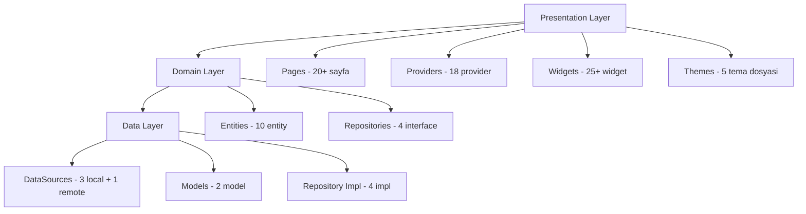
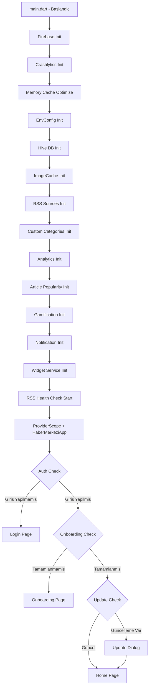
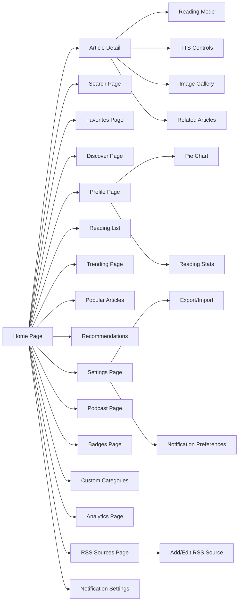

# 📊 Haber Merkezi - Kapsamlı Proje Analiz Raporu

**Rapor Tarihi:** 10 Mart 2026  
**Analiz Yapan:** Roo (Architect Mode)

---

## 1. PROJE GENEL BAKIŞ

**Proje Adı:** Haber Merkezim  
**Platform:** Flutter (Cross-platform - Android öncelikli)  
**Mimari:** Clean Architecture + Riverpod State Management  
**Dil:** Dart  
**Veritabanı:** Hive (Local NoSQL)  
**Backend:** Firebase (Auth, Crashlytics) + RSS Feed tabanlı  

### Teknik Yığın
| Bileşen | Teknoloji | Versiyon |
|---------|-----------|----------|
| Framework | Flutter | 3.38.3 |
| Dil | Dart | 3.10.1 |
| State Management | Riverpod | 2.6.1 |
| Local DB | Hive | 2.2.3 |
| HTTP Client | Dio | 5.4.0+ |
| Auth | Firebase Auth | - |
| Crash Reporting | Firebase Crashlytics | - |
| Localization | flutter_localizations | TR/EN |

---

## 2. MİMARİ ANALİZ

### 2.1 Katmanlı Yapı (Clean Architecture)

### 2.2 Klasör Yapısı Değerlendirmesi

| Katman | Dosya Sayısı | Durum | Değerlendirme |
|--------|-------------|-------|---------------|
| `core/constants` | 2 | ✅ İyi | API endpoints ve interest tags tanımlı |
| `core/error` | 3 | ✅ İyi | Enhanced error handler, exceptions, failures |
| `core/services` | 28 | ⚠️ Şişkin | Çok fazla servis, bazıları birleştirilebilir |
| `core/utils` | 4 | ✅ İyi | Retry helper, responsive helper vb. |
| `data/datasources` | 4 | ✅ İyi | Local/Remote ayrımı düzgün |
| `data/models` | 2 | ✅ İyi | Hive adaptörleri ile |
| `data/repositories` | 4 | ✅ İyi | Interface implementasyonları |
| `domain/entities` | 10 | ✅ İyi | Saf Dart sınıfları |
| `domain/repositories` | 4 | ✅ İyi | Soyut interface'ler |
| `presentation/pages` | 20+ | ⚠️ Geniş | Birçok sayfa mevcut |
| `presentation/providers` | 18 | ⚠️ Dikkat | Provider sayısı yüksek |
| `presentation/widgets` | 25+ | ✅ İyi | Modüler widget yapısı |
| `presentation/themes` | 5+ | ✅ İyi | Renk şemaları ve tema sistemi |

### 2.3 Mimari Güçlü Yönler
- ✅ Clean Architecture katmanlı yapısına sadık kalınmış
- ✅ Domain layer external dependency içermiyor
- ✅ Repository pattern doğru uygulanmış
- ✅ Entity-Model ayrımı yapılmış (Hive adaptörleri data layer'da)
- ✅ Riverpod ile reaktif state management

### 2.4 Mimari Zayıf Yönlar
- ⚠️ `core/services` altında 28 servis var - bazıları birbiriyle ilişkili ve birleştirilebilir
- ⚠️ Use Case katmanı eksik - Domain layer'da use case'ler yok, iş mantığı provider'lara dağılmış
- ⚠️ 18 provider dosyası - bazıları çok büyük olabilir, sorumluluklar karışabilir
- ⚠️ Dependency Injection yapısı net değil - servisler doğrudan singleton/static kullanıyor

---

## 3. ÖZELLİK ANALİZİ

### 3.1 Tamamlanan Özellikler

#### Çekirdek Özellikler
| Özellik | Durum | Açıklama |
|---------|-------|----------|
| RSS Feed Desteği | ✅ | Çoklu kaynak, RSS 2.0 ve Atom desteği |
| Offline Mod | ✅ | Hive ile local cache |
| Dark/Light Mode | ✅ | Dynamic Color + 5 renk şeması |
| Firebase Auth | ✅ | Kullanıcı giriş/kayıt |
| Firebase Crashlytics | ✅ | Hata raporlama |
| Localization | ✅ | Türkçe/İngilizce |
| Onboarding | ✅ | İlgi alanı seçimi |
| Text-to-Speech | ✅ | Sesli haber okuma |
| Podcast Desteği | ✅ | RSS podcast feed, audio player |
| Bildirim Sistemi | ✅ | Local notifications |
| Widget Desteği | ✅ | 3 tip Android widget |
| Arama | ✅ | Temel haber arama |

#### Gelişmiş Özellikler
| Özellik | Durum | Açıklama |
|---------|-------|----------|
| Favoriler | ✅ | Makale kaydetme |
| Okuma Listesi | ✅ | Sonra oku listesi |
| Trending Haberler | ✅ | Popüler içerik takibi |
| Özel Kategoriler | ✅ | Kullanıcı tanımlı kategoriler |
| İlgi Alanı Eşleştirme | ✅ | ML bazlı öneri sistemi |
| Gamification | ✅ | Rozetler ve istatistikler |
| RSS Kaynak Yönetimi | ✅ | Kullanıcı RSS ekleme/silme |
| RSS Health Check | ✅ | 6 saatte bir kaynak kontrolü |
| Profil İstatistikleri | ✅ | Okuma istatistikleri, pie chart |
| Okuma Modu | ✅ | Font, renk, satır aralığı ayarları |
| Dışa/İçe Aktarma | ✅ | Veri export/import |
| Performans Monitör | ✅ | Debug performans sayfası |

#### UI/UX Özellikleri
| Özellik | Durum | Açıklama |
|---------|-------|----------|
| Glassmorphism Cards | ✅ | Modern kart tasarımları |
| Custom Page Transitions | ✅ | 8 farklı geçiş animasyonu |
| Micro-Interactions | ✅ | Buton animasyonları, haptic feedback |
| Shimmer Loading | ✅ | İçerik yüklenme efekti |
| Hero Animations | ✅ | Sayfa geçiş animasyonları |
| Spacing System | ✅ | Tutarlı boşluk sistemi |
| Enhanced Typography | ✅ | Google Fonts entegrasyonu |
| Responsive Design | ✅ | Farklı ekran boyutları desteği |

### 3.2 Planlanan Ama Henüz Yapılmamış Özellikler
- ⏳ Backend API geliştirme
- ⏳ WebSocket backend implementasyonu
- ⏳ AI haber özetleri
- ⏳ Tablet/Geniş ekran optimizasyonu (master-detail layout)
- ⏳ Widget testleri ve integration testleri
- ⏳ API pagination backend entegrasyonu
- ⏳ Accessibility (WCAG) testleri
- ⏳ Sosyal özellikler (paylaşım, yorum)
- ⏳ Monetization altyapısı

---

## 4. PERFORMANS ANALİZİ

### 4.1 Bellek Kullanımı
| Metrik | Değer | Değerlendirme |
|--------|-------|---------------|
| Total PSS | 312 MB | ✅ Normal aralıkta |
| Native Heap | 51.4 MB | ✅ İyi |
| Dalvik Heap | 7.3 MB | ✅ Çok iyi |
| Code Memory | 21.7 MB | ✅ Makul |
| CPU Kullanımı | ~%0.5 | ✅ Çok düşük |

### 4.2 Uygulanan Optimizasyonlar
- ✅ Image cache boyutu 50 resimle sınırlandırılmış (varsayılan 1000)
- ✅ Image cache max boyut 25 MB (varsayılan 100 MB)
- ✅ ListView.builder ile lazy loading
- ✅ CachedNetworkImage ile resim cache
- ✅ Hive ile offline veri desteği
- ✅ Image prefetch servisi
- ✅ Optimized API Service (batching, compression, pagination)
- ✅ Cache-first strategy

### 4.3 Potansiyel Performans Sorunları
- ⚠️ `main.dart`'ta 12 servis sıralı (sequential) initialize ediliyor - paralel hale getirilebilir
- ⚠️ `app.dart`'ta `import 'package:flutter/foundation.dart'` iki kez import edilmiş (satır 3-4)
- ⚠️ 28 servis sınıfı başlangıçta yükleniyor - lazy initialization düşünülebilir
- ⚠️ `Private Other` bellek kullanımı 193.7 MB - incelenebilir

---

## 5. KOD KALİTESİ ANALİZİ

### 5.1 Güçlü Yönler
- ✅ Türkçe yorum satırları ve debug mesajları tutarlı
- ✅ Immutable pattern kullanımı (Entity copyWith)
- ✅ Hata yönetimi zengin (enhanced error handler, retry mechanism)
- ✅ RSS tarih parsing çok kapsamlı (RFC 2822, ISO 8601, Unix timestamp)
- ✅ HTML temizleme fonksiyonları mevcut
- ✅ Görsel URL çıkarma mantığı çok detaylı (6 farklı strateji)

### 5.2 İyileştirilebilir Alanlar
- ⚠️ Duplicate import: `app.dart` satır 3-4 aynı import
- ⚠️ `ArticleModel._generateId()` hashCode tabanlı - collision riski var, UUID daha güvenli
- ⚠️ Test coverage yetersiz - `test/` klasöründe sınırlı test
- ⚠️ `projeaciklama.md` gibi dosyalar workspace root'ta dağınık
- ⚠️ Use case katmanı eksik - iş mantığı provider'lara sızmış

### 5.3 Güvenlik Değerlendirmesi
- ✅ Firebase Crashlytics entegre
- ✅ Secure Storage servisi mevcut
- ⚠️ `google-services.json` ve `haber-merkezi-key.jks` repo root'ta - `.gitignore` kontrolü yapılmalı
- ⚠️ Environment config servisi var ama hassas bilgilerin nasıl saklandığı kontrol edilmeli

---

## 6. UYGULAMA AKIŞ DİYAGRAMI

---

## 7. SAYFALAR VE NAVİGASYON HARİTASI

---

## 8. SERVİS HARİTASI

### Core Servisler (28 adet)
| Servis | Sorumluluk | Bağımlılık |
|--------|-----------|------------|
| `HiveService` | Local DB yönetimi | Hive |
| `RssSourcesService` | RSS kaynak yönetimi | Hive |
| `AnalyticsService` | Kullanıcı analitikleri | Hive |
| `NotificationService` | Bildirim yönetimi | flutter_local_notifications |
| `WidgetService` | Android widget | - |
| `CustomCategoriesService` | Özel kategori | Hive |
| `RssHealthCheckService` | RSS sağlık kontrolü | Dio |
| `ImageCacheService` | Resim cache | - |
| `ArticlePopularityService` | Popülerlik hesaplama | Hive |
| `GamificationService` | Rozet ve puan | Hive |
| `EnvConfigService` | Ortam yapılandırma | - |
| `AuthService` | Kimlik doğrulama | Firebase |
| `CrashlyticsService` | Hata raporlama | Firebase |
| `TextToSpeechService` | Sesli okuma | TTS |
| `AudioPlayerService` | Ses oynatma | just_audio |
| `PodcastService` | Podcast yönetimi | Dio |
| `SearchService` | Arama | - |
| `RecommendationService` | Öneri sistemi | - |
| `MlRecommendationService` | ML bazlı öneri | - |
| `InterestMatchingService` | İlgi alanı eşleştirme | - |
| `RelatedArticlesService` | İlgili makaleler | - |
| `TrendingService` | Trend haberler | - |
| `BreakingNewsService` | Son dakika | - |
| `ArticleContentService` | Makale içerik | Dio |
| `ExportService` | Dışa aktarma | - |
| `SecureStorageService` | Güvenli depolama | - |
| `OptimizedApiService` | API optimizasyonu | Dio |
| `RealtimeUpdateService` | Canlı güncelleme | WebSocket |
| `AvatarService` | Kullanıcı avatar | - |
| `OnboardingService` | İlk kurulum | Hive |
| `UpdateService` | Uygulama güncelleme | - |
| `ImagePrefetchService` | Resim ön yükleme | - |
| `RssFeedValidator` | RSS doğrulama | Dio |

---

## 9. PROVIDER HARİTASI (18 adet)

| Provider | Tip | Sorumluluk |
|----------|-----|-----------|
| `newsProvider` | StateNotifier | Ana haber yönetimi |
| `themeProvider` | StateNotifier | Tema ve renk yönetimi |
| `localeProvider` | StateNotifier | Dil ayarları |
| `authProvider` | StateNotifier | Kimlik doğrulama durumu |
| `connectivityProvider` | Stream | İnternet bağlantısı |
| `favoritesProvider` | StateNotifier | Favori makaleler |
| `readingListProvider` | StateNotifier | Okuma listesi |
| `searchProvider` | StateNotifier | Arama durumu |
| `notificationProvider` | StateNotifier | Bildirim ayarları |
| `onboardingProvider` | StateNotifier | Onboarding durumu |
| `rssSourcesProvider` | StateNotifier | RSS kaynakları |
| `audioPlayerProvider` | StateNotifier | Ses oynatıcı |
| `gamificationProvider` | StateNotifier | Rozet ve puanlar |
| `analyticsProvider` | StateNotifier | Analitik verileri |
| `articleFilterProvider` | StateNotifier | Makale filtreleme |
| `readingModeProvider` | StateNotifier | Okuma modu ayarları |
| `personalizedNewsProvider` | StateNotifier | Kişisel haberler |
| `popularArticlesProvider` | StateNotifier | Popüler makaleler |
| `userProfileProvider` | StateNotifier | Kullanıcı profili |
| `categoryOrderProvider` | StateNotifier | Kategori sıralaması |
| `updateProvider` | Future | Güncelleme kontrolü |
| `notificationBannerProvider` | StateNotifier | Bildirim banner |

---

## 10. SONUÇ VE ÖNERİLER

### 10.1 Genel Değerlendirme

| Kategori | Puan | Değerlendirme |
|----------|------|---------------|
| Mimari | ⭐⭐⭐⭐ | Clean Architecture iyi uygulanmış ama use case katmanı eksik |
| Kod Kalitesi | ⭐⭐⭐⭐ | Genel olarak iyi, küçük iyileştirmeler gerekli |
| Özellik Zenginliği | ⭐⭐⭐⭐⭐ | Çok geniş özellik seti |
| Performans | ⭐⭐⭐⭐ | İyi optimize edilmiş, küçük iyileştirmeler mümkün |
| Test Coverage | ⭐⭐ | Yetersiz, ciddi iyileştirme gerekli |
| UI/UX | ⭐⭐⭐⭐ | Modern, animasyonlu ama tutarsızlıklar var |
| Güvenlik | ⭐⭐⭐ | Firebase Crashlytics var ama hassas dosyalar kontrol edilmeli |
| Dokümantasyon | ⭐⭐⭐⭐ | Kapsamlı dokümantasyon mevcut |

### 10.2 Kritik Öncelikli Öneriler

1. **Test Coverage Artırılmalı** - Mevcut durum çok düşük, en az %70 hedeflenmeli
2. **Use Case Katmanı Eklenmeli** - İş mantığı provider'lardan domain layer'a taşınmalı
3. **Servis Başlatma Optimize Edilmeli** - 12 sıralı init paralel hale getirilmeli
4. **Hassas Dosya Güvenliği** - `google-services.json`, `.jks` dosyaları `.gitignore` kontrolü
5. **Duplicate Import Düzeltilmeli** - `app.dart`'taki çift import

### 10.3 Orta Vadeli Öneriler

6. **Backend API Geliştirme** - Cihazlar arası senkronizasyon için kritik
7. **Tablet Optimizasyonu** - Master-detail layout ile geniş ekran desteği
8. **AI Haber Özetleri** - Rekabet avantajı sağlayacak
9. **Servisleri Birleştirme** - 28 servis çok fazla, ilişkili olanlar gruplanabilir
10. **Accessibility** - WCAG uyumluluğu test edilmeli

### 10.4 Proje İstatistikleri Özeti

| Metrik | Değer |
|--------|-------|
| Toplam Dart Dosyası | ~100+ |
| Sayfa Sayısı | 20+ |
| Provider Sayısı | 18+ |
| Servis Sayısı | 28+ |
| Entity Sayısı | 10 |
| Widget Sayısı | 25+ |
| Tema Dosyası | 5+ |
| Desteklenen Dil | 2 (TR/EN) |
| RAM Kullanımı | ~312 MB |
| CPU Kullanımı | ~%0.5 |

---

*Bu rapor, projenin mevcut durumunun kapsamlı bir analizini sunmaktadır. Sorularınız veya ek analiz ihtiyaçlarınız için bildiriniz.*