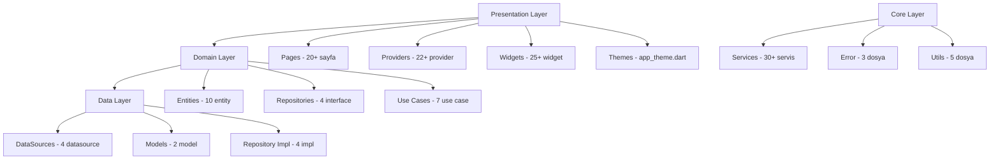
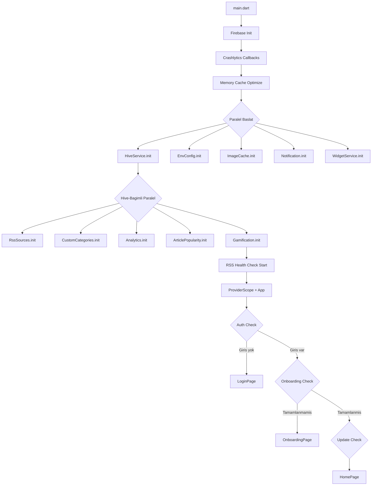

# 📊 Haber Merkezi - Kapsamlı Proje Analiz Raporu 2026

**Rapor Tarihi:** 16 Nisan 2026  
**Analiz Yapan:** Roo (Architect Mode)  
**Proje Versiyonu:** 1.0.0+1  
**Dart SDK:** ^3.8.1

---

## 1. PROJE GENEL DURUMU

### 1.1 Özet Bilgiler

| Özellik | Değer |
|---------|-------|
| **Proje Adı** | Haber Merkezim |
| **Platform** | Flutter (Cross-platform, Android öncelikli) |
| **Mimari** | Clean Architecture + Riverpod |
| **Dil** | Dart 3.8.1+ |
| **Veritabanı** | Hive (Local NoSQL) |
| **Backend** | Firebase (Auth, Crashlytics, Firestore, Storage, Analytics) + RSS Feed |
| **State Management** | flutter_riverpod 2.6.1 |
| **HTTP Client** | Dio 5.4.0 |
| **Localization** | TR / EN |

### 1.2 Proje İstatistikleri

| Metrik | Değer |
|--------|-------|
| Toplam Dart dosyası (lib/) | ~120+ |
| Sayfa sayısı | 20+ |
| Provider sayısı | 22+ |
| Servis sayısı | 30+ |
| Entity sayısı | 10 |
| Use Case sayısı | 7 |
| Widget sayısı | 25+ |
| Tema dosyası | 1 (700 satır) |
| Desteklenen dil | 2 (TR/EN) |

---

## 2. KULLANILAN TEKNOLOJİLER VE BAĞIMLILIKLAR

### 2.1 Temel Bağımlılıklar

| Paket | Versiyon | Amaç |
|-------|----------|------|
| flutter_riverpod | ^2.6.1 | State management |
| dio | ^5.4.0 | HTTP client |
| hive / hive_flutter | ^2.2.3 / ^1.1.0 | Local veritabanı |
| firebase_core | ^3.8.1 | Firebase çekirdeği |
| firebase_auth | ^5.3.3 | Kimlik doğrulama |
| cloud_firestore | ^5.5.3 | Cloud veritabanı |
| firebase_crashlytics | ^4.1.3 | Hata raporlama |
| firebase_analytics | ^11.3.8 | Analitik |
| connectivity_plus | ^7.0.0 | Bağlantı kontrolü |

### 2.2 UI/UX Bağımlılıkları

| Paket | Versiyon | Amaç |
|-------|----------|------|
| cached_network_image | ^3.3.1 | Resim cache |
| shimmer | ^3.0.0 | Loading efekti |
| flutter_animate | ^4.5.0 | Animasyonlar |
| dynamic_color | ^1.7.0 | Material You renk |
| google_fonts | ^6.1.0 | Tipografi |
| fl_chart | ^0.69.0 | Grafikler |
| lottie | ^3.1.2 | Lottie animasyonları |

### 2.3 Medya Bağımlılıkları

| Paket | Versiyon | Amaç |
|-------|----------|------|
| just_audio | ^0.9.36 | Ses oynatıcı |
| audio_service | ^0.18.12 | Arka plan ses |
| video_player | ^2.8.2 | Video oynatıcı |
| youtube_player_flutter | ^9.0.3 | YouTube |
| flutter_tts | ^4.0.2 | Sesli okuma |

### 2.4 Bağımlılık Değerlendirmesi

- **Toplam bağımlılık:** ~45+ paket — **ÇOK YÜKSEK**
- `cloud_firestore`, `firebase_storage`, `video_player`, `youtube_player_flutter`, `audio_service` gibi ağır paketler APK boyutunu ciddi artırır
- `web_socket_channel` ve `retry` paketleri eklendi ama aktif kullanımı belirsiz
- `pull_to_refresh` paketi artık bakımda değil, Flutter'ın kendi `RefreshIndicator`'ı tercih edilebilir

---

## 3. MİMARİ YAPI DEĞERLENDİRMESİ

### 3.1 Katmanlı Yapı

### 3.2 Mimari Güçlü Yönler

- ✅ Clean Architecture katmanları doğru ayrılmış (domain, data, presentation, core)
- ✅ Entity-Model ayrımı yapılmış (Hive adaptörleri data layer'da)
- ✅ Repository pattern interface ile tanımlı, implementasyon ayrı
- ✅ Use Case pattern uygulanmış (7 use case mevcut)
- ✅ Riverpod ile reaktif state management
- ✅ Cache-first stratejisi iyi uygulanmış
- ✅ Stream-based reactive updates (watchAllArticles)
- ✅ Paralel servis başlatma (`Future.wait`)

### 3.3 Mimari Zayıf Yönler

Aşağıda tespit edilen eksik ve sorunlar, önem seviyelerine göre kategorize edilmiştir.

---

## 4. TESPİT EDİLEN EKSİKLER VE SORUNLAR

### 4.1 MİMARİ SORUNLAR

| # | Sorun | Önem | Açıklama |
|---|-------|------|----------|
| M1 | core/services altında 30+ servis | **Yüksek** | Servislerin çoğu singleton/static pattern kullanıyor, DI (Dependency Injection) yapısı tutarsız. Bazı servisler Riverpod provider olarak tanımlı, bazıları doğrudan static çağrılıyor. |
| M2 | Use Case katmanı eksik kalıyor | **Yüksek** | 7 use case var ama sadece news domain'i için. Favorites, reading list, auth, gamification gibi alanlar için use case yok. İş mantığının önemli kısmı provider'lara ve servislere dağılmış. |
| M3 | NewsRepositoryImpl dispose edilmiyor | **Orta** | `_articlesStreamController` açılıyor ama `dispose()` metodu hiçbir yerden çağrılmıyor. Memory leak riski. |
| M4 | Provider'lar arası bağımlılık karmaşık | **Orta** | `providers.dart` dosyası hem tanımlama hem export hub olarak kullanılıyor. 22+ provider'ın bağımlılık grafiği takibi zor. |
| M5 | Router/Navigation yapısı yok | **Orta** | `MaterialApp.routes` ile basit named routing kullanılıyor. Go_router veya auto_route gibi bir routing çözümü yok. Deep linking, nested navigation desteği eksik. |
| M6 | Connectivity doğrudan repository'de kontrol ediliyor | **Düşük** | `Connectivity()` new instance olarak oluşturuluyor, test edilebilirlik düşük. |

### 4.2 KOD KALİTESİ SORUNLARI

| # | Sorun | Önem | Açıklama |
|---|-------|------|----------|
| K1 | `_generateId()` hashCode tabanlı | **Yüksek** | `article_model.dart` satır 411-418: `String.hashCode` kullanılıyor. Dart'ta hashCode platformlar arası tutarlı değil ve collision riski var. UUID veya SHA256 hash kullanılmalı. |
| K2 | `app_theme.dart` dosyası 700 satır | **Orta** | Tek dosyada light theme, dark theme, tüm renk tanımları, helper metodlar var. Bölünmeli. |
| K3 | debugPrint kullanımı tutarsız | **Orta** | Bazı yerlerde `AppLogger` kullanılıyor, bazı yerlerde doğrudan `debugPrint` çağrılıyor (ör: `article_model.dart`, `news_repository_impl.dart`). |
| K4 | `foundation.dart` import'u tutarsız | **Düşük** | Birçok dosyada `import 'package:flutter/foundation.dart'` sadece `debugPrint` için import ediliyor. `AppLogger` bunu soyutlamalı. |
| K5 | Hardcoded string'ler | **Düşük** | `news_repository_impl.dart`'ta kategori isimleri hardcoded list olarak tanımlı (satır 197). Constants dosyasından alınmalı. |
| K6 | `NewsState` duplicate property'ler | **Düşük** | `isError` ve `hasError`, `hasData` ve `hasArticles` aynı işi yapan duplicate getter'lar (satır 59-62). |

### 4.3 PERFORMANS SORUNLARI

| # | Sorun | Önem | Açıklama |
|---|-------|------|----------|
| P1 | Background refresh her kategoride 500ms delay | **Orta** | `news_repository_impl.dart` satır 209: Her kategori arasında `Future.delayed(500ms)` var. 12 kategori = minimum 6 saniye. Bu delay UI'ı rahatlatmak için ama çok uzun. |
| P2 | Background refresh stream her kategoride ara güncelleme gönderiyor | **Orta** | Satır 212-216: Her kategori yüklendikten sonra stream'e update gönderiliyor. 12 kategori = 12 state rebuild. Batch update yapılmalı. |
| P3 | `appInitializationProvider` 300ms yapay gecikme | **Düşük** | `providers.dart` satır 68: Minimum 300ms splash süresi zorlanıyor. Bu gereksiz bekleme. |
| P4 | `_OnboardingCheckWrapper` içinde `Future.delayed` anti-pattern | **Düşük** | `app.dart` satır 364: `build` metodu içinde `Future.delayed` çağrılıyor. Bu her rebuild'de yeni bir Future oluşturur. |

### 4.4 GÜVENLİK SORUNLARI

| # | Sorun | Önem | Açıklama |
|---|-------|------|----------|
| G1 | `.env` dosyası assets'e dahil | **Kritik** | `pubspec.yaml` satır 183: `.env` dosyası Flutter assets olarak tanımlı. Bu dosya APK içine gömülür ve reverse engineering ile okunabilir. |
| G2 | `firebase_options.dart` repo'da açık | **Yüksek** | Firebase yapılandırma bilgileri (API key, project ID vb.) doğrudan kod içinde. `.gitignore`'da değil. |
| G3 | AuthService hata mesajlarında email loglanıyor | **Orta** | `auth_service.dart` satır 78: `debugPrint('🔐 Email ile giriş yapılıyor: $email')` — hassas bilgi log'a yazılıyor. |
| G4 | `.env` dosyasında hassas bilgi yok ama yapı riskli | **Düşük** | Şu an `.env`'de API key yok ama yapı hazır. Birisi yanlışlıkla key ekleyebilir ve assets üzerinden açığa çıkar. |

### 4.5 TEST EKSİKLİKLERİ

| # | Sorun | Önem | Açıklama |
|---|-------|------|----------|
| T1 | Unit test yok | **Kritik** | `test/` klasöründe hiçbir unit test dosyası bulunamadı. Entity, model, use case, repository, service testleri tamamen eksik. |
| T2 | Integration testler yüzeysel | **Yüksek** | `integration_test/app_test.dart`'ta testler çoğunlukla `if (widget.evaluate().isNotEmpty)` ile conditional. Widget bulunamazsa test otomatik geçiyor — yanlış pozitif riski çok yüksek. |
| T3 | Mock/fake yapısı yok | **Yüksek** | Test için mock data source, fake repository, test provider override yapıları hiç kurulmamış. |
| T4 | Widget testleri yok | **Orta** | Ayrı widget testleri bulunmuyor. Özellikle `ArticleCard`, `CategoryTabs`, `NewsListWidget` gibi kritik widget'lar test edilmeli. |
| T5 | Golden testler yok | **Düşük** | UI regresyon testleri için golden test altyapısı kurulmamış. |

### 4.6 UI/UX EKSİKLİKLERİ

| # | Sorun | Önem | Açıklama |
|---|-------|------|----------|
| U1 | Tablet/Geniş ekran optimizasyonu yok | **Orta** | `responsive_helper.dart` mevcut ama master-detail layout gibi tablet-optimized layoutlar uygulanmamış. |
| U2 | Accessibility (WCAG) testleri yapılmamış | **Orta** | Semantic labels, contrast ratio kontrolü, screen reader desteği test edilmemiş. |
| U3 | Error state'ler tutarsız | **Düşük** | Bazı sayfalarda `ErrorRecoveryWidget` kullanılıyor, bazılarında inline error text. Tutarlı bir error UI pattern'i yok. |
| U4 | Boş durum (empty state) tutarsız | **Düşük** | `empty_state_widget.dart` var ama tüm sayfalarda kullanılmıyor. |

### 4.7 ERROR HANDLING EKSİKLİKLERİ

| # | Sorun | Önem | Açıklama |
|---|-------|------|----------|
| E1 | `toggleFavorite` ve `markAsRead` hataları sessizce yutulıyor | **Orta** | `news_provider.dart` satır 296-298 ve 316-318: catch bloğu sadece debug log yazıyor, kullanıcıya bilgi verilmiyor. |
| E2 | Repository hataları generic Exception fırlatıyor | **Orta** | `news_repository_impl.dart`: Tüm catch blokları `throw Exception('Failed to...')` ile generic hata fırlatıyor. Custom exception tipleri tanımlı ama kullanılmıyor. |
| E3 | Demo data fallback her zaman çalışıyor | **Düşük** | Network hatası durumunda demo makale gösteriliyor ama kullanıcıya offline olduğu bildirilmiyor. |

### 4.8 EKSİK ÖZELLİKLER

| # | Özellik | Önem | Açıklama |
|---|---------|------|----------|
| F1 | Backend API | **Yüksek** | Cihazlar arası senkronizasyon için sunucu tarafı API yok. Tüm veri local. |
| F2 | Sosyal özellikler | **Orta** | Yorum, paylaşım, topluluk özellikleri planlanmış ama uygulanmamış. |
| F3 | AI haber özetleri | **Orta** | Planlarda var ama implementasyon yok. |
| F4 | Monetization altyapısı | **Düşük** | Reklam veya premium üyelik altyapısı yok. |
| F5 | CI/CD pipeline | **Yüksek** | Otomatik build, test, deploy pipeline'ı kurulmamış. |

---

## 5. MEVCUT ÖZELLİKLER TABLOSU

### 5.1 Çekirdek Özellikler

| Özellik | Durum | Notlar |
|---------|-------|--------|
| RSS Feed desteği (RSS 2.0 + Atom) | ✅ | Çoklu kaynak, 12 kategori |
| Offline mod (Hive cache) | ✅ | Cache-first stratejisi |
| Dark/Light/Dynamic tema | ✅ | 5 renk şeması + Material You |
| Firebase Auth (Google + Email) | ✅ | Login/Register/Password Reset |
| Firebase Crashlytics | ✅ | Hata raporlama |
| Localization (TR/EN) | ✅ | ARB dosyaları ile |
| Onboarding (ilgi alanı seçimi) | ✅ | İlk giriş akışı |
| Text-to-Speech | ✅ | Sesli haber okuma |
| Podcast desteği | ✅ | RSS podcast feed, audio player |
| Bildirim sistemi | ✅ | Local notifications |
| Android Widget desteği | ✅ | 3 tip widget |
| Arama | ✅ | Temel arama |
| Favoriler | ✅ | Makale kaydetme |
| Okuma listesi | ✅ | Sonra oku |
| Trending haberler | ✅ | Popülerlik takibi |
| Gamification | ✅ | Rozetler, puanlar |
| RSS kaynak yönetimi | ✅ | Ekleme/silme/düzenleme |
| RSS Health Check | ✅ | 6 saatte bir kontrol |
| Profil istatistikleri | ✅ | Pie chart, okuma stats |
| Okuma modu | ✅ | Font/renk/satır aralığı |
| Dışa/İçe aktarma | ✅ | Veri export/import |
| Performans monitör | ✅ | Debug performans sayfası |
| Kişiselleştirilmiş haberler | ✅ | ML bazlı öneri |
| İlgili makaleler | ✅ | Makale detayında |

### 5.2 UI/UX Özellikleri

| Özellik | Durum |
|---------|-------|
| Glassmorphism kartlar | ✅ |
| Custom page transitions (8 tip) | ✅ |
| Micro-interactions + Haptic feedback | ✅ |
| Shimmer loading | ✅ |
| Hero animasyonları | ✅ |
| Google Fonts (Merriweather) | ✅ |
| Responsive design | ✅ (kısıtlı) |
| Pull-to-refresh | ✅ |
| Pagination (client-side) | ✅ |

---

## 6. UYGULAMA AKIŞ DİYAGRAMI

---

## 7. ÖNERİLEN İYİLEŞTİRMELER (Öncelik Sırasına Göre)

### 🔴 Kritik Öncelik

| # | İyileştirme | Etki | Efor |
|---|-------------|------|------|
| 1 | **`.env` dosyasını assets'ten kaldır** — `pubspec.yaml`'dan `.env` satırını sil, `flutter_dotenv` yerine `--dart-define` veya compile-time env kullan | Güvenlik | Düşük |
| 2 | **Unit test altyapısı kur** — En az article_model, news_repository, use case'ler için unit testler yaz. Mock yapısı kur (mockito veya mocktail) | Kalite | Yüksek |

### 🟠 Yüksek Öncelik

| # | İyileştirme | Etki | Efor |
|---|-------------|------|------|
| 3 | **`_generateId()` UUID'ye çevir** — `uuid` paketi ekle, hashCode yerine UUID v5 kullan | Veri bütünlüğü | Düşük |
| 4 | **firebase_options.dart'ı gitignore'a ekle** | Güvenlik | Düşük |
| 5 | **Integration testleri düzelt** — Conditional test'leri kaldır, mock provider'lar ile gerçek assertion'lar yaz | Kalite | Orta |
| 6 | **CI/CD pipeline kur** — GitHub Actions veya Codemagic ile otomatik build + test | DevOps | Orta |
| 7 | **Use Case katmanını genişlet** — favorites, reading_list, auth, gamification use case'leri ekle | Mimari | Orta |
| 8 | **Servis sayısını azalt** — İlişkili servisleri birleştir (recommendation + ml_recommendation + interest_matching → RecommendationModule) | Mimari | Yüksek |

### 🟡 Orta Öncelik

| # | İyileştirme | Etki | Efor |
|---|-------------|------|------|
| 9 | **Router kütüphanesi ekle** — go_router ile type-safe navigation, deep linking | UX/Mimari | Orta |
| 10 | **Background refresh optimizasyonu** — 500ms delay'i kaldır, batch stream update yap | Performans | Düşük |
| 11 | **Custom exception'ları kullan** — `exceptions.dart`'taki tipleri repository ve service'lerde aktif kullan | Error handling | Düşük |
| 12 | **Logging tutarlılığı** — Tüm `debugPrint` çağrılarını `AppLogger`'a çevir | Kalite | Düşük |
| 13 | **Auth loglarından hassas bilgileri kaldır** — Email, token gibi bilgileri loglardan çıkar | Güvenlik | Düşük |
| 14 | **app_theme.dart'ı böl** — colors.dart, light_theme.dart, dark_theme.dart, theme_helpers.dart | Kalite | Düşük |
| 15 | **Tablet optimizasyonu** — Master-detail layout ile geniş ekran desteği | UX | Yüksek |
| 16 | **Accessibility audit** — Semantic labels, contrast ratio kontrolü | UX | Orta |

### 🟢 Düşük Öncelik

| # | İyileştirme | Etki | Efor |
|---|-------------|------|------|
| 17 | **`pull_to_refresh` paketini kaldır** — Flutter'ın yerleşik `RefreshIndicator`'ını kullan | Bakım | Düşük |
| 18 | **Kullanılmayan bağımlılıkları temizle** — web_socket_channel, flutter_staggered_grid_view aktif kullanımda mı kontrol et | Boyut | Düşük |
| 19 | **Golden test altyapısı kur** — UI regresyon testleri | Kalite | Orta |
| 20 | **Error UI pattern'ini standartlaştır** — Tüm sayfalarda aynı error widget kullan | UX | Düşük |
| 21 | **NewsState duplicate getter'ları temizle** — `isError`/`hasError` ve `hasData`/`hasArticles` birini kaldır | Kalite | Düşük |
| 22 | **`NewsRepositoryImpl.dispose()` çağrısını ekle** — Provider dispose'da repository stream controller'ı kapat | Bellek | Düşük |

---

## 8. GENEL DEĞERLENDİRME PUANLARI

| Kategori | Puan (5 üzerinden) | Değerlendirme |
|----------|---------------------|---------------|
| **Mimari** | ⭐⭐⭐⭐ | Clean Architecture iyi uygulanmış, use case eksiklikleri var |
| **Kod Kalitesi** | ⭐⭐⭐½ | Genel iyi, tutarsızlıklar ve küçük sorunlar mevcut |
| **Özellik Zenginliği** | ⭐⭐⭐⭐⭐ | Çok geniş özellik seti, impressif |
| **Performans** | ⭐⭐⭐⭐ | İyi optimize edilmiş, küçük iyileştirmeler mümkün |
| **Test Coverage** | ⭐ | Kritik seviyede yetersiz, unit test sıfır |
| **UI/UX** | ⭐⭐⭐⭐ | Modern, animasyonlu, tablet desteği eksik |
| **Güvenlik** | ⭐⭐½ | .env assets sorunu kritik, auth logları riskli |
| **Dokümantasyon** | ⭐⭐⭐⭐ | Kapsamlı docs ve plans mevcut |
| **DevOps/CI** | ⭐ | Pipeline yok, otomatik test/build yok |
| **Error Handling** | ⭐⭐⭐ | Retry mekanizması iyi, custom exception kullanımı eksik |

---

## 9. SONUÇ

Haber Merkezi projesi, zengin özellik seti ve temiz mimari yapısıyla güçlü bir Flutter uygulamasıdır. Özellikle Clean Architecture uyumu, cache-first stratejisi, paralel servis başlatma ve çeşitli medya desteği (podcast, TTS, video) öne çıkan güçlü yönlerdir.

Ancak projenin en kritik eksiklikleri:

1. **Test altyapısının tamamen eksik olması** — Hiçbir unit test yok, integration testler yüzeysel
2. **Güvenlik açıkları** — `.env` dosyasının APK'ya gömülmesi, firebase_options'ın açık olması
3. **CI/CD pipeline eksikliği** — Otomatik build ve test süreci yok

Bu üç alan acil olarak ele alınmalıdır. Özellik geliştirme yerine kalite ve güvenlik iyileştirmelerine öncelik verilmesi önerilir.

---

*Bu rapor, projenin 16 Nisan 2026 tarihindeki durumunun kapsamlı bir analizini sunmaktadır.*