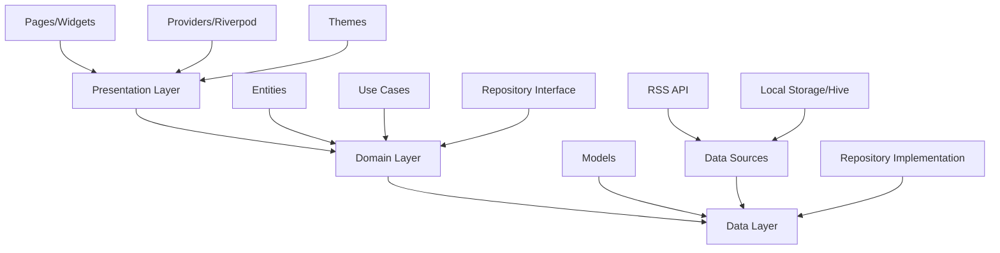
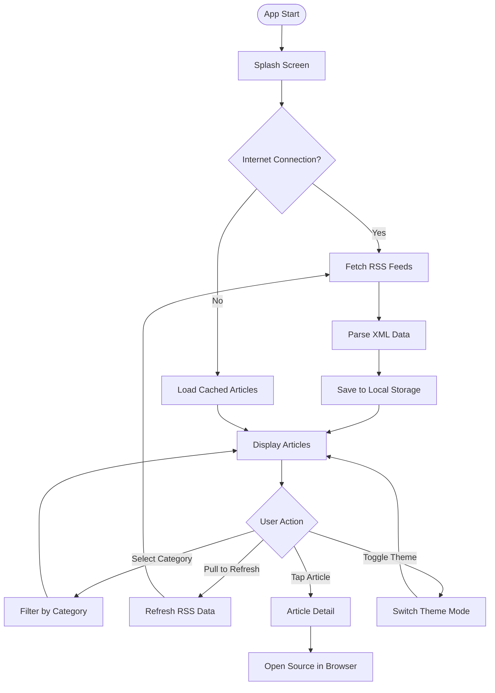
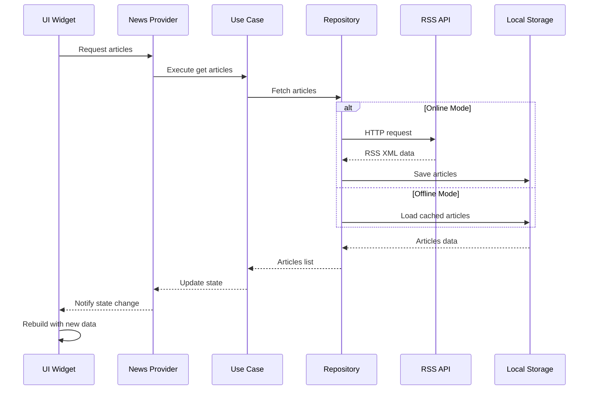
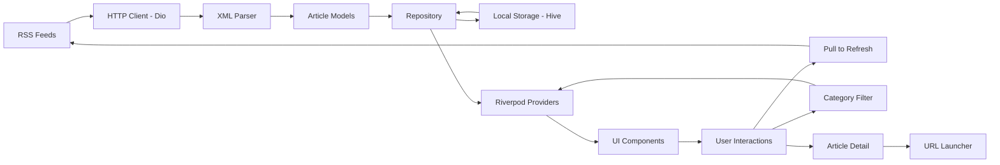
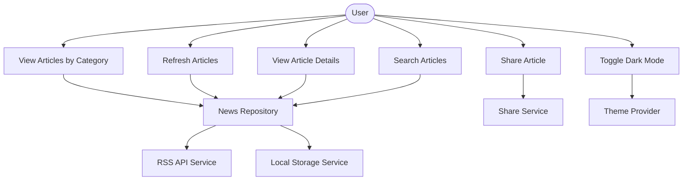
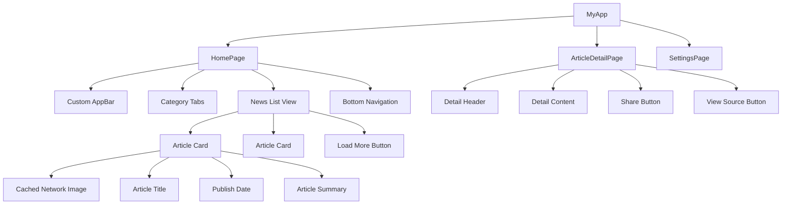

# Haber Merkezi - Sistem Diyagramları

## 🏗️ Clean Architecture Diyagramı



## 📱 Uygulama Akış Diyagramı



## 🔄 State Management Akışı (Riverpod)



## 🗄️ Data Flow Diyagramı



## 🎯 Use Case Diyagramı



## 📊 Component Hierarchy



## 🔧 Error Handling Flow

```mermaid
flowchart TD
    Start([API Call]) --> TryFetch{Try Fetch RSS}
    TryFetch -->|Success| ParseData[Parse XML Data]
    TryFetch -->|Network Error| CheckCache{Cache Available?}
    TryFetch -->|Server Error| ShowError[Show Error Message]
    
    CheckCache -->|Yes| LoadCache[Load Cached Data]
    CheckCache -->|No| ShowOffline[Show Offline Message]
    
    ParseData --> ValidateData{Data Valid?}
    ValidateData -->|Yes| UpdateUI[Update UI]
    ValidateData -->|No| ShowError
    
    LoadCache --> UpdateUI
    ShowError --> RetryButton[Show Retry Button]
    ShowOffline --> RetryButton
    
    RetryButton --> TryFetch
    UpdateUI --> End([Complete])