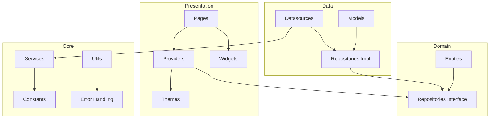
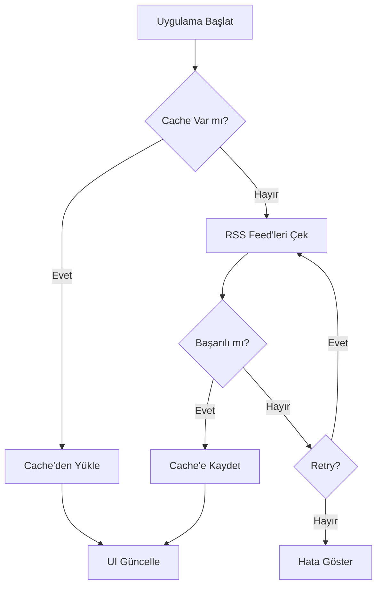
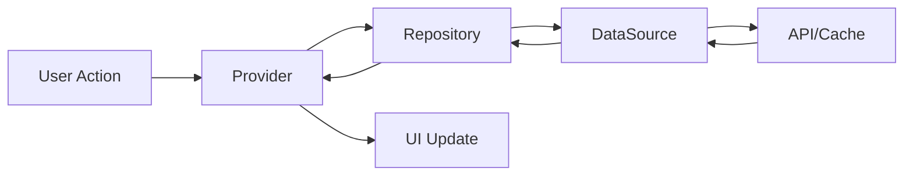

# 📱 Haber Merkezi - Kapsamlı Geliştirme Planı 2026

## 🎯 Proje Özeti

**Haber Merkezi**, Flutter ile geliştirilmiş modern bir RSS tabanlı haber uygulamasıdır. Türkiye'deki çeşitli haber kaynaklarından haberleri toplayarak kullanıcılara sunar.

---

## 📊 Mevcut Durum Analizi

### ✅ Tamamlanan Özellikler

| Kategori | Özellik | Durum |
|----------|---------|-------|
| **Core** | RSS Feed Desteği - 107 kaynak | ✅ |
| **Core** | Offline Mod - Hive Database | ✅ |
| **Core** | Dark/Light Tema | ✅ |
| **Core** | Onboarding Akışı | ✅ |
| **Media** | Podcast Desteği | ✅ |
| **Media** | Text-to-Speech | ✅ |
| **Media** | Video Player | ✅ |
| **UX** | Favoriler ve Okuma Listesi | ✅ |
| **UX** | Kişiselleştirilmiş Haberler | ✅ |
| **UX** | Trending Haberler | ✅ |
| **UX** | Arama Fonksiyonu | ✅ |
| **Platform** | Android Widget Desteği | ✅ |
| **Platform** | Local Notifications | ✅ |
| **Platform** | Analytics | ✅ |
| **Infra** | Error Handling ve Retry | ✅ |
| **Infra** | RSS Health Check | ✅ |

### 🏗️ Mimari Yapı



### 📈 Performans Metrikleri

| Metrik | Mevcut | Hedef |
|--------|--------|-------|
| RAM Kullanımı | ~312 MB | <250 MB |
| CPU Kullanımı | %0.5 | <%1.0 |
| Startup Süresi | ~4 sn | <3 sn |
| RSS Başarı Oranı | %95 | %98+ |
| APK Boyutu | ~68 MB | <50 MB |

---

## 🚀 Geliştirme Fazları

### Faz 1: Stabilite ve Performans İyileştirmeleri

#### 1.1 RSS Feed Optimizasyonu
- [ ] Çalışmayan RSS kaynaklarını tespit et ve düzelt
- [ ] Alternatif RSS URL'leri ekle
- [ ] Feed timeout değerlerini optimize et
- [ ] Paralel feed yükleme stratejisini iyileştir

#### 1.2 Görsel Optimizasyonu
- [ ] CachedNetworkImage parametrelerini optimize et
- [ ] Progressive image loading ekle
- [ ] Placeholder ve shimmer animasyonlarını iyileştir
- [ ] Memory cache boyutunu ayarla

#### 1.3 Liste Performansı
- [ ] ListView.builder cacheExtent değerini optimize et
- [ ] Pagination implementasyonu
- [ ] Lazy loading mekanizması
- [ ] AutomaticKeepAlive kullanımı

#### 1.4 State Management Optimizasyonu
- [ ] Riverpod select kullanımını yaygınlaştır
- [ ] Gereksiz rebuild'leri tespit et ve önle
- [ ] Memoization ekle

### Faz 2: UI/UX İyileştirmeleri

#### 2.1 Material Design 3 Güncellemeleri
- [ ] Dynamic color support ekle
- [ ] Tema renklerini güncelle
- [ ] Typography sistemini iyileştir
- [ ] Component'leri MD3'e uyumlu hale getir

#### 2.2 Animasyonlar
- [ ] Hero animations ekle
- [ ] Page transitions iyileştir
- [ ] Pull-to-refresh animasyonunu özelleştir
- [ ] Micro-interactions ekle

#### 2.3 Gesture Kontrolleri
- [ ] Swipe-to-dismiss implementasyonu
- [ ] Haptic feedback ekle
- [ ] Double-tap to like
- [ ] Long-press context menu

#### 2.4 Empty States ve Loading
- [ ] Empty state tasarımları oluştur
- [ ] Skeleton loading ekle
- [ ] Error state tasarımlarını iyileştir
- [ ] Snackbar tasarımlarını güncelle

### Faz 3: Yeni Özellikler

#### 3.1 Gelişmiş Arama
- [ ] Tarih filtresi ekle
- [ ] Kaynak filtresi ekle
- [ ] Kategori filtresi ekle
- [ ] Arama geçmişi kaydet
- [ ] Arama önerileri göster

#### 3.2 Popüler Haberler
- [ ] En çok okunan listesi
- [ ] Trending kategoriler
- [ ] Haftalık/Aylık istatistikler
- [ ] Paylaşım sayısı tracking

#### 3.3 Bildirim İyileştirmeleri
- [ ] Zengin bildirimler
- [ ] Akıllı zamanlama
- [ ] Kategori bazlı bildirimler
- [ ] Breaking news bildirimleri

#### 3.4 Yorum Sistemi
- [ ] Lokal yorum kaydetme
- [ ] Yorum listeleme
- [ ] Yorum düzenleme/silme

### Faz 4: Platform Genişletme

#### 4.1 Tablet Optimizasyonu
- [ ] Responsive layout tasarımı
- [ ] Master-detail view
- [ ] Landscape mode desteği

#### 4.2 iOS Optimizasyonları
- [ ] Cupertino widgets kullanımı
- [ ] iOS-specific features
- [ ] App Store hazırlığı

#### 4.3 Web Desteği
- [ ] PWA support
- [ ] Responsive web tasarımı
- [ ] SEO optimizasyonu

### Faz 5: Test ve Kalite

#### 5.1 Unit Tests
- [ ] Service testleri
- [ ] Repository testleri
- [ ] Provider testleri
- [ ] Utility testleri

#### 5.2 Widget Tests
- [ ] Component testleri
- [ ] Page testleri
- [ ] Integration testleri

#### 5.3 Performans Testleri
- [ ] Memory leak tespiti
- [ ] FPS monitoring
- [ ] Startup time analizi

### Faz 6: Yayınlama Hazırlığı

#### 6.1 Store Materyalleri
- [ ] App icon finalize
- [ ] Feature graphic tasarımı
- [ ] Screenshots hazırlama
- [ ] Store listing metni

#### 6.2 Dokümantasyon
- [ ] README güncelleme
- [ ] CHANGELOG oluşturma
- [ ] Gizlilik politikası
- [ ] Kullanım koşulları

#### 6.3 Release
- [ ] Release APK/AAB oluşturma
- [ ] ProGuard kuralları
- [ ] Signing configuration
- [ ] Play Store yükleme

---

## 🔧 Teknik Borç ve İyileştirmeler

### Kod Kalitesi
- [ ] Flutter analyze hatalarını düzelt
- [ ] Deprecated API'leri güncelle
- [ ] Code formatting uygula
- [ ] Documentation comments ekle

### Güvenlik
- [ ] API key güvenliği
- [ ] Secure storage kullanımı
- [ ] Network security config
- [ ] Certificate pinning

### Monitoring
- [ ] Crash reporting
- [ ] Performance monitoring
- [ ] User analytics
- [ ] Error tracking

---

## 📁 Dosya Yapısı

```
lib/
├── main.dart                    # Uygulama giriş noktası
├── core/
│   ├── constants/               # API endpoints, sabitler
│   ├── services/                # 17 servis
│   ├── error/                   # Exception ve Failure
│   └── utils/                   # Yardımcı fonksiyonlar
├── data/
│   ├── datasources/             # Local ve Remote
│   ├── models/                  # Hive modelleri
│   └── repositories/            # Repository impl
├── domain/
│   ├── entities/                # Entity sınıfları
│   └── repositories/            # Repository interfaces
└── presentation/
    ├── pages/                   # 20+ sayfa
    ├── providers/               # 18 Riverpod provider
    ├── widgets/                 # Özel widget'lar
    └── themes/                  # Tema yapılandırması
```

---

## 🎯 Öncelik Sıralaması

### 🔴 Yüksek Öncelik
1. RSS Feed stabilizasyonu
2. Performans optimizasyonları
3. Kritik bug düzeltmeleri
4. Test coverage artırımı

### 🟡 Orta Öncelik
1. UI/UX iyileştirmeleri
2. Yeni özellikler
3. Material Design 3
4. Animasyonlar

### 🟢 Düşük Öncelik
1. Platform genişletme
2. Firebase entegrasyonu
3. Monetization
4. Çoklu dil desteği

---

## 📊 Başarı Kriterleri

| Kriter | Hedef |
|--------|-------|
| Test Coverage | >60% |
| Crash-free Rate | >99% |
| App Store Rating | >4.0 |
| Startup Time | <3 sn |
| RAM Usage | <250 MB |
| RSS Success Rate | >98% |

---

## 🔄 Akış Diyagramları

### Haber Yükleme Akışı



### State Management Akışı



---

**Oluşturulma Tarihi:** 2026-01-02
**Son Güncelleme:** 2026-01-02
**Versiyon:** 1.0