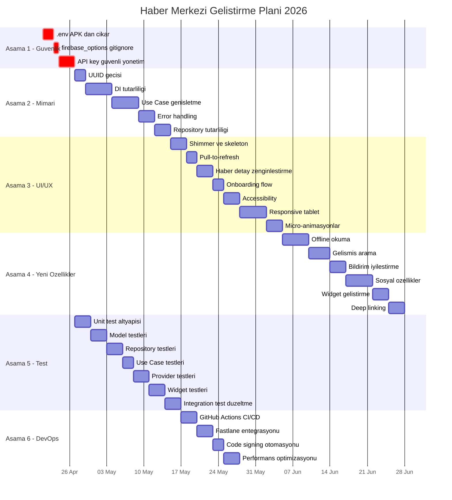
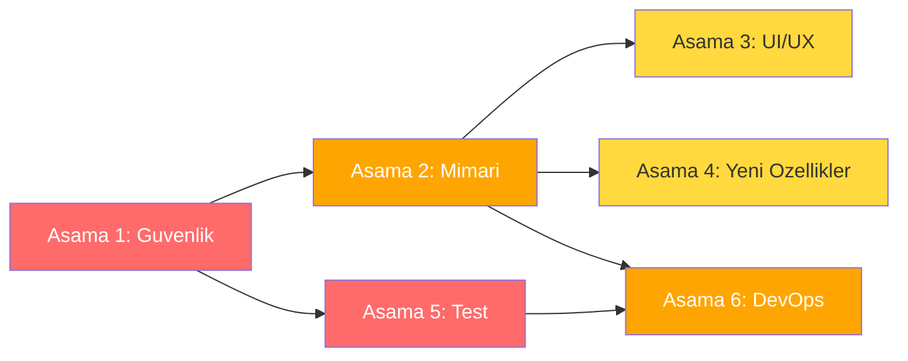

# 🚀 Haber Merkezi - Kapsamlı Geliştirme Planı 2026

**Oluşturulma Tarihi:** 16 Nisan 2026  
**Dayanak:** [proje_tam_analiz_2026.md](../docs/proje_tam_analiz_2026.md)  
**Toplam Tahmini Süre:** 14-18 hafta

---

## Plan Genel Bakış

---

## Aşama 1 — Güvenlik Düzeltmeleri (Kritik - Hemen)

**Tahmini Süre:** 1 hafta  
**Öncelik:** 🔴 Kritik  
**Bağımlılıklar:** Yok (ilk başlanacak aşama)

### Başarı Kriterleri
- `.env` dosyası APK içinde bulunmuyor (APK reverse engineering ile doğrulanabilir)
- `firebase_options.dart` git geçmişinden temizlenmiş ve `.gitignore`'a eklenmiş
- Tüm API key'ler compile-time veya runtime güvenli yöntemle sağlanıyor
- Hassas bilgiler log çıktılarında görünmüyor

### Detaylı Görev Listesi

#### 1.1 `.env` Dosyasının APK'dan Çıkarılması
| # | Görev | Detay |
|---|-------|-------|
| 1.1.1 | `pubspec.yaml`'dan `.env` asset satırını kaldır | `pubspec.yaml` satır ~183'teki `.env` referansını sil |
| 1.1.2 | `flutter_dotenv` paketini kaldır | `pubspec.yaml`'dan dependency'yi sil, tüm import'ları temizle |
| 1.1.3 | `envied` paketini ekle | Compile-time env variable çözümü olarak `envied` ve `envied_generator` ekle |
| 1.1.4 | `env.dart` sınıfı oluştur | `@Envied` annotation ile environment variable'ları tanımla |
| 1.1.5 | `EnvConfig` sınıfını güncelle | `flutter_dotenv` çağrılarını `envied` generated sınıfına yönlendir |
| 1.1.6 | Build script'lerini güncelle | `--dart-define-from-file=.env` ile build komutlarını dokümante et |
| 1.1.7 | `.env.example` dosyasını güncelle | Yeni yapıya uygun örnek dosya |

#### 1.2 `firebase_options.dart` Güvenliği
| # | Görev | Detay |
|---|-------|-------|
| 1.2.1 | `.gitignore`'a `lib/firebase_options.dart` ekle | Dosyayı versiyon kontrolünden çıkar |
| 1.2.2 | Git geçmişinden temizle | `git rm --cached lib/firebase_options.dart` |
| 1.2.3 | `firebase_options.dart.example` oluştur | Placeholder değerlerle örnek dosya |
| 1.2.4 | README'ye setup talimatı ekle | Yeni geliştiriciler için Firebase kurulum adımları |

#### 1.3 API Key Güvenli Yönetimi
| # | Görev | Detay |
|---|-------|-------|
| 1.3.1 | Tüm hardcoded key'leri tespit et | Proje genelinde API key, secret taraması |
| 1.3.2 | `--dart-define` yapısını implemente et | Ortam değişkenlerini compile-time'da inject et |
| 1.3.3 | Auth loglarından hassas bilgileri kaldır | `auth_service.dart`'ta email/token loglarını temizle (G3) |
| 1.3.4 | Güvenlik dokümantasyonu yaz | Key yönetim prosedürlerini belgele |

---

## Aşama 2 — Mimari/Altyapı İyileştirmeleri

**Tahmini Süre:** 2.5 hafta  
**Öncelik:** 🟠 Yüksek  
**Bağımlılıklar:** Aşama 1 tamamlanmış olmalı

### Başarı Kriterleri
- Tüm ID generation UUID tabanlı, hashCode kullanımı sıfır
- Tüm servisler Riverpod provider üzerinden erişilebilir
- Her domain alanı için en az temel use case'ler mevcut
- Custom exception'lar tüm repository'lerde kullanılıyor
- `AppLogger` tek logging mekanizması

### Detaylı Görev Listesi

#### 2.1 ID Generation UUID'ye Geçiş
| # | Görev | Detay |
|---|-------|-------|
| 2.1.1 | `uuid` paketini ekle | `pubspec.yaml`'a `uuid: ^4.x` ekle |
| 2.1.2 | `_generateId()` metodunu güncelle | `article_model.dart` satır 411-418: hashCode yerine UUID v5 kullan |
| 2.1.3 | Mevcut veri migration planla | Eski hashCode ID'li verilerle uyumluluk stratejisi |
| 2.1.4 | Diğer model'lerdeki ID generation'ları kontrol et | Tüm model dosyalarında hashCode kullanımını tara |

#### 2.2 DI Tutarlılığı
| # | Görev | Detay |
|---|-------|-------|
| 2.2.1 | Static servis envanteri çıkar | `core/services/` altındaki tüm singleton/static servisleri listele |
| 2.2.2 | Servis provider'ları oluştur | Her servis için Riverpod provider tanımla |
| 2.2.3 | Static çağrıları provider'a çevir | Tüm `ServiceX.instance` çağrılarını `ref.read/watch` ile değiştir |
| 2.2.4 | İlişkili servisleri birleştir | recommendation + ml_recommendation + interest_matching → `RecommendationModule` |
| 2.2.5 | Provider organizasyonunu düzenle | `providers.dart`'ı feature-based dosyalara böl: `news_providers.dart`, `auth_providers.dart`, vb. |
| 2.2.6 | Connectivity'yi injectable yap | `Connectivity()` new instance yerine provider üzerinden sağla (M6) |

#### 2.3 Use Case Katmanının Genişletilmesi
| # | Görev | Detay |
|---|-------|-------|
| 2.3.1 | Bookmark use case'leri | `AddBookmark`, `RemoveBookmark`, `GetBookmarks`, `IsBookmarked` |
| 2.3.2 | Settings use case'leri | `GetSettings`, `UpdateSettings`, `ResetSettings` |
| 2.3.3 | User/Auth use case'leri | `SignIn`, `SignOut`, `GetCurrentUser`, `UpdateProfile` |
| 2.3.4 | Gamification use case'leri | `GetUserBadges`, `CheckAchievement`, `UpdateScore` |
| 2.3.5 | Reading List use case'leri | `AddToReadingList`, `RemoveFromReadingList`, `GetReadingList` |
| 2.3.6 | Provider'lardaki iş mantığını use case'lere taşı | Provider'lar sadece state yönetimi yapmalı |

#### 2.4 Error Handling İyileştirmeleri
| # | Görev | Detay |
|---|-------|-------|
| 2.4.1 | Custom exception'ları aktifleştir | `exceptions.dart`'taki tipleri tüm repository catch bloklarında kullan (E2) |
| 2.4.2 | Sessiz hata yutmayı düzelt | `toggleFavorite`, `markAsRead` hatalarını kullanıcıya bildir (E1) |
| 2.4.3 | Offline durumu kullanıcıya bildir | Demo data fallback'te offline banner göster (E3) |
| 2.4.4 | Error UI pattern'ini standartlaştır | Tüm sayfalarda `ErrorRecoveryWidget` kullan (U3) |
| 2.4.5 | Logging tutarlılığını sağla | Tüm `debugPrint` çağrılarını `AppLogger`'a çevir (K3, K4) |

#### 2.5 Repository Pattern Tutarlılığı
| # | Görev | Detay |
|---|-------|-------|
| 2.5.1 | `NewsRepositoryImpl.dispose()` ekle | StreamController kapatma mekanizması (M3) |
| 2.5.2 | Repository dispose'u provider'a bağla | Provider dispose callback'inde repository'yi temizle |
| 2.5.3 | Hardcoded kategori listesini constants'a taşı | `news_repository_impl.dart` satır 197 (K5) |
| 2.5.4 | `NewsState` duplicate getter'ları temizle | `isError`/`hasError`, `hasData`/`hasArticles` birini kaldır (K6) |
| 2.5.5 | Background refresh optimizasyonu | 500ms delay'i kaldır, batch stream update yap (P1, P2) |

---

## Aşama 3 — UI/UX Geliştirmeleri

**Tahmini Süre:** 3 hafta  
**Öncelik:** 🟡 Orta  
**Bağımlılıklar:** Aşama 2 tamamlanmış olmalı (error handling ve DI düzeltmeleri UI'ı etkiler)

### Başarı Kriterleri
- Tüm veri yükleme ekranlarında shimmer/skeleton loading mevcut
- Pull-to-refresh tüm liste sayfalarında çalışıyor
- Haber detay sayfasında paylaşım, font ayarı ve okuma modu mevcut
- Onboarding flow 3+ adımdan oluşuyor ve atlanabilir
- WCAG 2.1 AA seviyesinde accessibility sağlanmış
- Tablet'te master-detail layout çalışıyor
- Sayfa geçişlerinde tutarlı animasyonlar var

### Detaylı Görev Listesi

#### 3.1 Shimmer/Skeleton Loading Ekranları
| # | Görev | Detay |
|---|-------|-------|
| 3.1.1 | Skeleton widget kütüphanesi oluştur | Tekrar kullanılabilir skeleton card, list, detail bileşenleri |
| 3.1.2 | Ana sayfa skeleton | Haber listesi loading skeleton |
| 3.1.3 | Detay sayfa skeleton | Makale detay loading skeleton |
| 3.1.4 | Profil sayfası skeleton | İstatistik kartları skeleton |
| 3.1.5 | Discover sayfası skeleton | Kategori ve trending skeleton |

#### 3.2 Pull-to-Refresh Animasyonları
| # | Görev | Detay |
|---|-------|-------|
| 3.2.1 | `pull_to_refresh` paketini kaldır | Flutter'ın yerleşik `RefreshIndicator`'ına geç |
| 3.2.2 | Custom refresh indicator tasarla | Marka uyumlu animasyonlu refresh göstergesi |
| 3.2.3 | Tüm liste sayfalarına uygula | Home, Discover, Favorites, Reading List sayfaları |

#### 3.3 Haber Detay Sayfası Zenginleştirme
| # | Görev | Detay |
|---|-------|-------|
| 3.3.1 | Paylaşım butonu ekle | Native share sheet ile haber paylaşımı |
| 3.3.2 | Font boyutu ayar slider'ı | Okuma sırasında font büyütme/küçültme |
| 3.3.3 | Okuma modu geliştirme | Sepia, dark, AMOLED dark okuma modları |
| 3.3.4 | Tahmini okuma süresi gösterimi | Kelime sayısına göre okuma süresi hesaplama |
| 3.3.5 | İlgili makaleler bölümü iyileştirme | Horizontal scroll, daha iyi kart tasarımı |

#### 3.4 Onboarding Flow
| # | Görev | Detay |
|---|-------|-------|
| 3.4.1 | Onboarding sayfa tasarımı | 4 adımlı: Hoşgeldin, Kategoriler, Bildirimler, Tema |
| 3.4.2 | İlerleme göstergesi | Dot indicator ile sayfa takibi |
| 3.4.3 | Atla butonu | Her adımda "Atla" seçeneği |
| 3.4.4 | Animasyonlu geçişler | Lottie veya custom animasyonlar |

#### 3.5 Accessibility İyileştirmeleri
| # | Görev | Detay |
|---|-------|-------|
| 3.5.1 | Semantic labels ekle | Tüm interaktif widget'lara `Semantics` wrapper |
| 3.5.2 | Contrast ratio kontrolü | WCAG AA minimum 4.5:1 contrast sağla |
| 3.5.3 | Screen reader testi | TalkBack/VoiceOver ile gezinme testi |
| 3.5.4 | Focus management | Tab sırası ve focus trap düzenlemesi |
| 3.5.5 | Metin ölçeklendirme desteği | `textScaleFactor` ile uyumlu layout |

#### 3.6 Responsive Tasarım (Tablet Desteği)
| # | Görev | Detay |
|---|-------|-------|
| 3.6.1 | Breakpoint sistemi güncelle | `responsive_helper.dart`'ı genişlet: phone, tablet, desktop |
| 3.6.2 | Master-detail layout | Tablet'te sol liste + sağ detay görünümü |
| 3.6.3 | Grid layout adaptasyonu | Tablet'te 2-3 sütunlu kart grid'i |
| 3.6.4 | Navigation rail | Tablet'te bottom nav yerine side navigation |
| 3.6.5 | Drawer adaptasyonu | Tablet'te persistent drawer |

#### 3.7 Micro-Animasyonlar ve Geçiş Efektleri
| # | Görev | Detay |
|---|-------|-------|
| 3.7.1 | Sayfa geçiş animasyonlarını standartlaştır | Tutarlı slide/fade geçişleri |
| 3.7.2 | Like/Bookmark animasyonu | Kalp/bayrak ikon animasyonu |
| 3.7.3 | Liste item animasyonları | Staggered list giriş animasyonu |
| 3.7.4 | Buton press feedback | Ripple + scale micro-interaction |
| 3.7.5 | `app_theme.dart` dosyasını böl | colors, light_theme, dark_theme, helpers olarak ayır (K2) |

---

## Aşama 4 — Yeni Özellikler

**Tahmini Süre:** 3.5 hafta  
**Öncelik:** 🟡 Orta  
**Bağımlılıklar:** Aşama 2 (mimari iyileştirmeler) tamamlanmış olmalı

### Başarı Kriterleri
- Kullanıcı internet olmadan önceden yüklenen haberleri okuyabiliyor
- Arama sayfasında tarih, kaynak ve kategori filtresi çalışıyor
- Topic-based push notification sistemi aktif
- Sosyal paylaşım ve yorum altyapısı çalışıyor
- En az 3 farklı widget boyutu mevcut
- Deep link ile doğrudan haber detayına gidilebiliyor

### Detaylı Görev Listesi

#### 4.1 Offline Okuma Modu
| # | Görev | Detay |
|---|-------|-------|
| 4.1.1 | Offline storage stratejisi tasarla | Hive'da tam makale içeriği + resim cache |
| 4.1.2 | Makale indirme mekanizması | Tek makale ve toplu indirme (kategori bazlı) |
| 4.1.3 | İndirme durumu göstergesi | Download progress indicator |
| 4.1.4 | Offline banner/indicator | Bağlantı kesildiğinde kullanıcıya bilgi |
| 4.1.5 | Otomatik cache yönetimi | Eski makalelerin temizlenmesi, storage limit |
| 4.1.6 | Resim offline cache'i | `cached_network_image` ile önceden indirme |

#### 4.2 Gelişmiş Arama
| # | Görev | Detay |
|---|-------|-------|
| 4.2.1 | Arama filtre UI tasarla | Filter chip'leri: tarih aralığı, kaynak, kategori |
| 4.2.2 | Tarih aralığı filtresi | DateRangePicker ile başlangıç-bitiş tarihi |
| 4.2.3 | Kaynak seçim filtresi | Multiselect chip ile RSS kaynak filtreleme |
| 4.2.4 | Kategori filtresi | Kategori bazlı arama daraltma |
| 4.2.5 | Arama geçmişi | Son aramaları kaydetme ve gösterme |
| 4.2.6 | Arama önerileri | Trending kelimeler ve otomatik tamamlama |

#### 4.3 Bildirim Sistemi İyileştirmeleri
| # | Görev | Detay |
|---|-------|-------|
| 4.3.1 | Topic-based bildirim altyapısı | Firebase Cloud Messaging topic subscription |
| 4.3.2 | Kategori bazlı bildirim tercihleri | Kullanıcı hangi kategorilerden bildirim alacağını seçebilir |
| 4.3.3 | Scheduled bildirimler | Günlük özet bildirimi (sabah/akşam) |
| 4.3.4 | Bildirim gruplaması | Aynı kaynaktan gelen bildirimleri gruplama |
| 4.3.5 | Rich notification | Büyük resimli, action butonlu bildirimler |

#### 4.4 Sosyal Özellikler
| # | Görev | Detay |
|---|-------|-------|
| 4.4.1 | Yorum sistemi altyapısı | Firestore tabanlı yorum collection |
| 4.4.2 | Yorum UI bileşenleri | Yorum listesi, yorum yazma, yanıtlama |
| 4.4.3 | Paylaşım istatistikleri | Hangi haberlerin ne kadar paylaşıldığı |
| 4.4.4 | Kullanıcı profili geliştirme | Herkese açık profil, okuma istatistikleri |
| 4.4.5 | Reaksiyon sistemi | Haber tepkileri: beğen, şaşır, üz |

#### 4.5 Widget Geliştirmeleri
| # | Görev | Detay |
|---|-------|-------|
| 4.5.1 | Small widget (2x1) | Tek haber başlığı widget'ı |
| 4.5.2 | Medium widget (2x2) | Resimli haber kartı widget'ı |
| 4.5.3 | Large widget (4x2) | Haber listesi widget'ı |
| 4.5.4 | Widget özelleştirme | Kategori ve kaynak seçimi |
| 4.5.5 | Widget güncelleme periyodu optimizasyonu | Pil dostu güncelleme stratejisi |

#### 4.6 Deep Linking
| # | Görev | Detay |
|---|-------|-------|
| 4.6.1 | `go_router` entegrasyonu | Mevcut named routing'i go_router'a geçir (M5) |
| 4.6.2 | URL şeması tanımla | `habermerkezi://article/{id}`, `habermerkezi://category/{name}` |
| 4.6.3 | Android App Links konfigürasyonu | `AndroidManifest.xml` intent filter |
| 4.6.4 | Universal link handler | Gelen link'i doğru sayfaya yönlendirme |
| 4.6.5 | Paylaşım link'i oluşturma | Firebase Dynamic Links veya custom URL |

---

## Aşama 5 — Test Altyapısı

**Tahmini Süre:** 3 hafta  
**Öncelik:** 🔴 Kritik (Aşama 1 ile paralel başlayabilir)  
**Bağımlılıklar:** Aşama 1 tamamlandıktan sonra başlayabilir, Aşama 2 ile paralel yürütülebilir

### Başarı Kriterleri
- `test/` klasöründe organize test dosya yapısı mevcut
- Mockito/Mocktail ile mock altyapısı kurulmuş
- Model serialization/deserialization testleri geçiyor
- Repository testleri mock data source ile çalışıyor
- Tüm use case'ler test edilmiş
- Kritik widget'lar (ArticleCard, NewsList) widget test'i mevcut
- Integration testler gerçek assertion'lar içeriyor
- Code coverage minimum %70

### Detaylı Görev Listesi

#### 5.1 Unit Test Altyapısı Kurulumu
| # | Görev | Detay |
|---|-------|-------|
| 5.1.1 | Test bağımlılıklarını ekle | `mocktail`, `faker`, `build_runner` (test) |
| 5.1.2 | Test klasör yapısını oluştur | `test/unit/`, `test/widget/`, `test/integration/` |
| 5.1.3 | Mock sınıfları oluştur | `MockNewsRepository`, `MockRssRemoteDataSource`, `MockHiveService` |
| 5.1.4 | Test fixture/factory oluştur | `ArticleFactory`, `CategoryFactory` — test verisi üretimi |
| 5.1.5 | Test helper utilities | Provider test wrapper, pump widget helper |

#### 5.2 Model Testleri
| # | Görev | Detay |
|---|-------|-------|
| 5.2.1 | `ArticleModel` testleri | `fromRssItem()`, `toEntity()`, `fromEntity()`, JSON serialization |
| 5.2.2 | `CategoryModel` testleri | Serialization, equality |
| 5.2.3 | Entity testleri | `Article`, `Category` entity equality ve property testleri |
| 5.2.4 | Edge case testleri | Null field'lar, boş string, geçersiz tarih formatları |

#### 5.3 Repository Testleri
| # | Görev | Detay |
|---|-------|-------|
| 5.3.1 | `NewsRepositoryImpl` testleri | `getAllArticles`, `getArticlesByCategory`, cache-first stratejisi |
| 5.3.2 | Offline senaryoları | Bağlantı yokken cache'den okuma |
| 5.3.3 | Error senaryoları | Network hatası, parse hatası, cache hatası |
| 5.3.4 | Stream testleri | `watchAllArticles` stream güncellemelerini test et |

#### 5.4 Use Case Testleri
| # | Görev | Detay |
|---|-------|-------|
| 5.4.1 | `GetAllArticles` testi | Normal akış ve hata durumları |
| 5.4.2 | `GetArticlesByCategory` testi | Kategori filtreleme doğruluğu |
| 5.4.3 | `ToggleArticleFavorite` testi | Favori ekleme/çıkarma toggle mantığı |
| 5.4.4 | `MarkArticleAsRead` testi | Okundu işaretleme |
| 5.4.5 | Yeni use case testleri | Aşama 2'de eklenen use case'lerin testleri |

#### 5.5 Provider/ViewModel Testleri
| # | Görev | Detay |
|---|-------|-------|
| 5.5.1 | `newsProvider` testleri | State geçişleri: loading → data, loading → error |
| 5.5.2 | `authProvider` testleri | Login, logout, session restore |
| 5.5.3 | `settingsProvider` testleri | Tema değişikliği, dil değişikliği |
| 5.5.4 | Provider override testleri | Mock repository ile provider davranışı |

#### 5.6 Widget Testleri
| # | Görev | Detay |
|---|-------|-------|
| 5.6.1 | `ArticleCard` widget testi | Render, tap callback, favoriye ekleme |
| 5.6.2 | `NewsListWidget` widget testi | Liste render, boş durum, hata durumu |
| 5.6.3 | `CategoryTabs` widget testi | Tab değişimi, seçili tab gösterimi |
| 5.6.4 | `ErrorRecoveryWidget` testi | Retry callback, hata mesajı gösterimi |
| 5.6.5 | `EmptyStateWidget` testi | İkon, mesaj, aksiyon butonu |

#### 5.7 Integration Test Düzeltmeleri
| # | Görev | Detay |
|---|-------|-------|
| 5.7.1 | Mevcut integration testleri analiz et | Conditional test anti-pattern'lerini tespit et (T2) |
| 5.7.2 | Mock provider override'lar kur | Test ortamı için fake data source |
| 5.7.3 | Gerçek assertion'larla yeniden yaz | `expect()` ile kesin doğrulama |
| 5.7.4 | Happy path senaryoları | Ana akışları test et: haber listele, detay aç, favoriye ekle |
| 5.7.5 | Code coverage raporu kur | `flutter test --coverage` + `lcov` rapor |

---

## Aşama 6 — Performans ve DevOps

**Tahmini Süre:** 2 hafta  
**Öncelik:** 🟠 Yüksek  
**Bağımlılıklar:** Aşama 5 (test altyapısı) CI/CD için gerekli

### Başarı Kriterleri
- Image cache hit rate %90+
- Sayfa açılış süresi ortalama 300ms altında
- Memory leak tespit edilmiş ve düzeltilmiş
- GitHub Actions ile her PR'da otomatik test çalışıyor
- Fastlane ile tek komutla Android build + deploy
- Code signing otomatik, secret'lar güvenli

### Detaylı Görev Listesi

#### 6.1 Image Caching Optimizasyonu
| # | Görev | Detay |
|---|-------|-------|
| 6.1.1 | Cache stratejisi analizi | Mevcut `cached_network_image` konfigürasyonunu incele |
| 6.1.2 | Cache boyut limiti ayarla | Maximum cache boyutu ve eviction policy |
| 6.1.3 | Thumbnail/progressive loading | Düşük çözünürlük önizleme → tam çözünürlük |
| 6.1.4 | WebP format desteği | Sunucu tarafında WebP dönüşüm veya client-side |

#### 6.2 Lazy Loading İyileştirmeleri
| # | Görev | Detay |
|---|-------|-------|
| 6.2.1 | Liste pagination optimizasyonu | Server-side pagination altyapısı (mümkünse) |
| 6.2.2 | `appInitializationProvider` 300ms gecikmeyi kaldır | Gereksiz yapay gecikmeyi sil (P3) |
| 6.2.3 | `_OnboardingCheckWrapper` Future.delayed düzelt | `build` içindeki anti-pattern'i düzelt (P4) |
| 6.2.4 | Deferred loading | Nadir kullanılan sayfaları deferred import ile yükle |

#### 6.3 Memory Leak Kontrolü
| # | Görev | Detay |
|---|-------|-------|
| 6.3.1 | DevTools memory profiling | Uygulama kullanımında memory profil çıkar |
| 6.3.2 | StreamController leak'leri düzelt | Tüm açık stream'lerin dispose edildiğini doğrula |
| 6.3.3 | Image cache memory limiti | `PaintingBinding.instance.imageCache.maximumSize` ayarla |
| 6.3.4 | Kullanılmayan bağımlılıkları temizle | `web_socket_channel`, `flutter_staggered_grid_view` kontrol et |

#### 6.4 GitHub Actions CI/CD Pipeline
| # | Görev | Detay |
|---|-------|-------|
| 6.4.1 | `.github/workflows/ci.yml` oluştur | PR tetiklemeli workflow |
| 6.4.2 | Lint adımı | `flutter analyze` |
| 6.4.3 | Test adımı | `flutter test --coverage` |
| 6.4.4 | Build adımı | `flutter build apk --release` |
| 6.4.5 | Coverage rapor adımı | Codecov veya Coveralls entegrasyonu |
| 6.4.6 | Branch protection rules | main branch'e direkt push engelleme |

#### 6.5 Fastlane Entegrasyonu
| # | Görev | Detay |
|---|-------|-------|
| 6.5.1 | Fastlane kurulumu | `android/fastlane/` yapısını oluştur |
| 6.5.2 | `Fastfile` lane'leri tanımla | `beta`, `release`, `test` lane'leri |
| 6.5.3 | Play Store upload otomasyonu | Internal testing track'e otomatik yükleme |
| 6.5.4 | Changelog otomasyonu | Git commit'lerden otomatik changelog |

#### 6.6 Code Signing Otomasyonu
| # | Görev | Detay |
|---|-------|-------|
| 6.6.1 | Keystore yönetimi | Keystore dosyasını güvenli depola (GitHub Secrets) |
| 6.6.2 | `key.properties` template | CI ortamında otomatik oluşturma |
| 6.6.3 | Release build imzalama | Otomatik signing konfigürasyonu |
| 6.6.4 | Environment bazlı build | dev, staging, production flavor'ları |

---

## Aşama Bağımlılık Diyagramı

### Paralel Yürütme Planı

| Hafta | Ana Akış | Paralel Akış |
|-------|----------|--------------|
| 1 | Aşama 1: Güvenlik | — |
| 2-3 | Aşama 2: Mimari (2.1-2.3) | Aşama 5: Test Altyapısı (5.1-5.2) |
| 4 | Aşama 2: Mimari (2.4-2.5) | Aşama 5: Test (5.3-5.4) |
| 5-7 | Aşama 3: UI/UX | Aşama 5: Test (5.5-5.7) |
| 8-10 | Aşama 4: Yeni Özellikler | — |
| 11-12 | Aşama 6: DevOps | — |

---

## Risk Tablosu

| Risk | Olasılık | Etki | Azaltma Stratejisi |
|------|----------|------|---------------------|
| UUID migration mevcut veriyi bozar | Orta | Yüksek | Migration script + backward compatibility |
| Test yazımı geliştirme hızını düşürür | Yüksek | Orta | Kritik path'ler öncelikli, %70 hedef yeterli |
| go_router geçişi regression yaratır | Orta | Orta | Feature flag ile kademeli geçiş |
| Firebase options temizliği mevcut CI'ı bozar | Düşük | Yüksek | CI ortamında env-based config |
| Tablet layout mevcut UI'ı bozar | Orta | Orta | Responsive wrapper ile izolasyon |

---

## Özet Metrikler

| Metrik | Mevcut | Hedef |
|--------|--------|-------|
| Unit Test Coverage | %0 | %70+ |
| Güvenlik Puanı | ⭐⭐½ | ⭐⭐⭐⭐ |
| Mimari Puanı | ⭐⭐⭐⭐ | ⭐⭐⭐⭐½ |
| DevOps Puanı | ⭐ | ⭐⭐⭐⭐ |
| UI/UX Puanı | ⭐⭐⭐⭐ | ⭐⭐⭐⭐½ |
| Toplam Görev Sayısı | — | ~120 görev |
| Toplam Tahmini Süre | — | 14-18 hafta |

---

*Bu plan, [proje_tam_analiz_2026.md](../docs/proje_tam_analiz_2026.md) raporundaki bulgulara dayanarak hazırlanmıştır.*