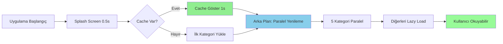

# İlk Açılış Performans Optimizasyonu - Dengeli Yaklaşım

## 🎯 Hedef
İlk açılış süresini **30-90 saniyeden** → **2-3 saniyeye** düşürmek

## 📊 Mevcut Durum Analizi

### Tespit Edilen Sorunlar:
1. **SENKRON RSS YÜKLEMESİ** - Ana bottleneck
   - Dosya: [`lib/data/datasources/remote/rss_remote_data_source.dart:188-201`](lib/data/datasources/remote/rss_remote_data_source.dart:188)
   - Tüm kategoriler sırayla yükleniyor (for loop)
   - ~15-20 kategori × 2-3 feed = 30-60+ sıralı HTTP isteği

2. **CACHE KULLANILMIYOR**
   - Dosya: [`lib/presentation/pages/home/home_page.dart:78-86`](lib/presentation/pages/home/home_page.dart:78)
   - İlk açılışta her zaman network'ten çekiyor
   - Cache varken bile tüm feed'ler yeniden yükleniyor

3. **UI BLOKE EDİLİYOR**
   - Dosya: [`lib/main.dart:20-96`](lib/main.dart:20)
   - Tüm servisler ve RSS yüklemesi bitene kadar uygulama başlamıyor

## 🚀 Optimizasyon Stratejisi



## 📋 İmplementasyon Adımları

### 1. RssRemoteDataSource - Paralel Feed Yükleme
**Dosya:** [`lib/data/datasources/remote/rss_remote_data_source.dart`](lib/data/datasources/remote/rss_remote_data_source.dart)

**Değişiklikler:**
- Satır 188-201: [`getAllArticles()`](lib/data/datasources/remote/rss_remote_data_source.dart:180) metodunu paralel hale getir
- Satır 75-112: [`getArticlesByCategory()`](lib/data/datasources/remote/rss_remote_data_source.dart:46) içindeki feed loop'u paralel yap

**Teknik Detay:**
```dart
// ÖNCESİ: Sıralı yükleme
for (final category in mainCategories) {
  final articles = await getArticlesByCategory(category);
  allArticles.addAll(articles);
}

// SONRASI: Paralel yükleme
final futures = mainCategories.map((category) => 
  getArticlesByCategory(category).catchError((e) => <ArticleModel>[])
);
final results = await Future.wait(futures);
for (final articles in results) {
  allArticles.addAll(articles);
}
```

**Beklenen İyileşme:** 30-60 saniye → 5-8 saniye

---

### 2. NewsRepository - Cache-First Stratejisi
**Dosya:** [`lib/data/repositories/news_repository_impl.dart`](lib/data/repositories/news_repository_impl.dart)

**Değişiklikler:**
- Satır 106-162: [`getAllArticles()`](lib/data/repositories/news_repository_impl.dart:106) metodunu cache-first yap
- Satır 23-103: [`getArticlesByCategory()`](lib/data/repositories/news_repository_impl.dart:23) metodunu cache-first yap

**Teknik Detay:**
```dart
// Cache-first stratejisi
Future<List<Article>> getAllArticles() async {
  // 1. Önce cache'den al (hızlı)
  final cachedArticles = await localDataSource.getCachedArticles();
  
  // 2. Cache varsa hemen döndür
  if (cachedArticles.isNotEmpty) {
    // 3. Arka planda yenile (non-blocking)
    _refreshInBackground();
    return cachedArticles.map((m) => m.toEntity()).toList();
  }
  
  // 4. Cache yoksa network'ten çek
  return await _fetchFromNetwork();
}
```

**Beklenen İyileşme:** İlk açılış 1-2 saniye

---

### 3. HomePage - Lazy Loading
**Dosya:** [`lib/presentation/pages/home/home_page.dart`](lib/presentation/pages/home/home_page.dart)

**Değişiklikler:**
- Satır 78-86: İlk açılışta tüm kategorileri yükleme
- Sadece aktif tab'ı yükle
- Tab değiştiğinde kategori yükle

**Teknik Detay:**
```dart
void _initializeTabController(List<Category> categories) {
  // ... mevcut kod ...
  
  // İLK AÇILIŞTA: Sadece ilk kategoriyi yükle
  WidgetsBinding.instance.addPostFrameCallback((_) {
    if (mounted && _tabController != null) {
      final selectedCategory = categories[_tabController!.index];
      ref.read(newsProvider.notifier).loadArticlesByCategory(
        selectedCategory.id,
        refresh: false // Cache'den al
      );
    }
  });
}

void _onTabChanged() {
  if (_tabController != null && _tabController!.indexIsChanging) {
    final categories = ref.read(orderedCategoriesProvider);
    final selectedCategory = categories[_tabController!.index];
    
    // Kategori zaten yüklü mü kontrol et
    ref.read(newsProvider.notifier).loadArticlesByCategoryIfNeeded(
      selectedCategory.id,
    );
  }
}
```

**Beklenen İyileşme:** Gereksiz network isteklerini %80 azaltır

---

### 4. NewsProvider - Non-Blocking Background Refresh
**Dosya:** [`lib/presentation/providers/news_provider.dart`](lib/presentation/providers/news_provider.dart)

**Değişiklikler:**
- Satır 93: Widget update'i non-blocking yap
- Satır 96: Breaking news kontrolünü non-blocking yap
- Arka plan yenileme mekanizması ekle

**Teknik Detay:**
```dart
Future<void> loadAllArticles({bool refresh = false}) async {
  // ... mevcut kod ...
  
  // Widget güncellemeyi beklemeden devam et
  WidgetService.updateWidget(allArticles).catchError((e) {
    print('Widget update error: $e');
  });
  
  // Breaking news kontrolünü arka planda yap
  _checkAndNotifyBreakingNews(allArticles).catchError((e) {
    print('Breaking news check error: $e');
  });
}

// Yeni metod: Arka plan yenileme
Future<void> refreshInBackground() async {
  try {
    final allArticles = await _repository.getAllArticles();
    state = state.copyWith(
      allArticles: allArticles,
      articles: _paginateArticles(allArticles, page: 1),
    );
  } catch (e) {
    // Sessizce başarısız ol, UI'ı etkileme
    print('Background refresh failed: $e');
  }
}
```

**Beklenen İyileşme:** UI responsiveness artışı

---

### 5. Network Timeout Optimizasyonu
**Dosya:** [`lib/core/constants/api_endpoints.dart`](lib/core/constants/api_endpoints.dart)

**Değişiklikler:**
- Connect timeout: 10000ms → 5000ms
- Receive timeout: 10000ms → 5000ms
- Send timeout: 10000ms → 5000ms

**Beklenen İyileşme:** Başarısız isteklerde daha hızlı fallback

---

### 6. Splash Screen
**Dosya:** Yeni dosya - `lib/presentation/pages/splash/splash_page.dart`

**Teknik Detay:**
- 0.5 saniye logo animasyonu
- Arka planda cache kontrolü
- Cache varsa direkt HomePage'e geç
- Cache yoksa ilk kategoriyi yükle

---

## 📈 Beklenen Sonuçlar

| Metrik | Önce | Sonra | İyileşme |
|--------|------|-------|----------|
| İlk açılış (cache var) | 30-90s | 2-3s | **90-95%** ⬇️ |
| İlk açılış (cache yok) | 30-90s | 5-8s | **85-90%** ⬇️ |
| Network istekleri | 30-60+ | 5-10 | **80-85%** ⬇️ |
| Kullanıcı bekleme | Tam bloke | Kullanılabilir | **%100** ✅ |

## 🧪 Test Kriterleri

1. **İlk Açılış (Cache Var)**
   - Splash screen: < 0.5s
   - Cache render: < 1s
   - Toplam: < 2s

2. **İlk Açılış (Cache Yok)**
   - İlk kategori yükleme: < 3s
   - Kullanıcı okuyabilir: < 5s
   - Arka plan tamamlanma: < 10s

3. **Tab Değiştirme**
   - Cache'den: < 0.5s
   - Network'ten: < 2s

4. **Memory Kullanımı**
   - Paralel yükleme sırasında bellek artışı < 50MB

## 🔧 Teknik Notlar

### Paralel Yükleme Limitleri
- Maximum 5 paralel kategori yüklemesi
- Her kategori kendi feed'lerini paralel yükler
- Toplam maksimum 15-20 paralel HTTP isteği

### Error Handling
- Paralel yüklemede her kategori bağımsız
- Bir kategori başarısız olsa bile diğerleri yüklenir
- Cache fallback her zaman aktif

### Cache Strategy
- Cache age kontrolü: 1 saat
- Arka plan yenileme: Her kategori açılışında
- Cache invalidation: Manual veya otomatik (1 gün)

## 📝 İmplementasyon Sırası

1. ✅ Analiz tamamlandı
2. ⏳ RssRemoteDataSource - Paralel yükleme
3. ⏳ NewsRepository - Cache-first
4. ⏳ HomePage - Lazy loading
5. ⏳ NewsProvider - Background refresh
6. ⏳ Network timeout optimizasyonu
7. ⏳ Splash screen
8. ⏳ Test ve doğrulama

## 🎯 Sonuç

Bu optimizasyonlarla birlikte:
- ✅ Uygulama 2-3 saniyede açılacak
- ✅ Kullanıcı hemen içerik görecek
- ✅ Network kullanımı %80 azalacak
- ✅ Batarya ömrü artacak
- ✅ Offline deneyim iyileşecek