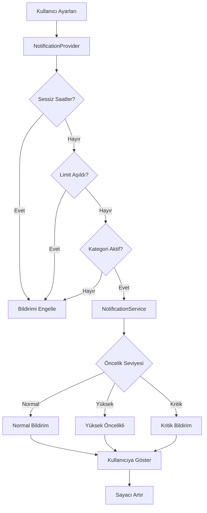
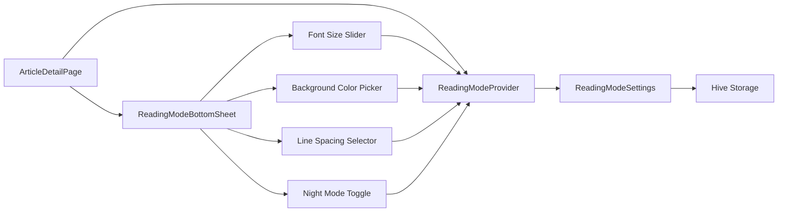

# Akıllı Bildirim Sistemi ve Okuma Modu Özelleştirme - Teknik Planlama

## 📋 Genel Bakış

Bu dokümantasyon, Haber Merkezi uygulamasına eklenecek iki önemli özelliğin teknik planlamasını içerir:

1. **Akıllı Bildirim Sistemi** - Kategori bazlı, zamanlı ve kişiselleştirilmiş bildirim yönetimi
2. **Okuma Modu Özelleştirme** - Kullanıcı deneyimini artıran okuma ayarları

---

## 🎯 Mimari Diyagramlar

### Akıllı Bildirim Sistemi - Veri Akışı



### Okuma Modu - Bileşen İlişkisi



---

## 🔔 1. AKILLI BİLDİRİM SİSTEMİ

### 1.1 Özellik Özeti

**Hedef:** Kullanıcılara kişiselleştirilmiş, akıllı ve rahatsız etmeyen bir bildirim deneyimi sunmak.

**Ana Özellikler:**
- ✅ Kategori bazlı bildirim filtreleme
- ✅ Sessiz saatler (Quiet Hours)
- ✅ Günlük bildirim limiti (spam önleme)
- ✅ Öncelik seviyelerine göre bildirim tonu/titreşim
- ✅ Zaman bazlı hatırlatmalar

### 1.2 Dosya Yapısı

**Yeni/Güncellenecek Dosyalar:**

```
lib/
├── core/
│   └── services/
│       └── notification_service.dart (GÜNCELLE)
├── presentation/
│   ├── providers/
│   │   └── notification_provider.dart (GÜNCELLE)
│   └── pages/
│       └── notifications/
│           └── notification_preferences_page.dart (GÜNCELLE)
```

### 1.3 NotificationSettings Modeli - Genişletme

**Dosya:** `lib/presentation/providers/notification_provider.dart`

**Eklenecek Alanlar:**

```dart
class NotificationSettings {
  // MEVCUT ALANLAR (korunacak)
  final bool dailyNewsEnabled;
  final int dailyNewsHour;
  final int dailyNewsMinute;
  final bool readingGoalEnabled;
  final int readingGoalHour;
  final int readingGoalMinute;
  final int dailyReadingGoal;
  final bool breakingNewsEnabled;
  final Map<String, bool> categoryNotifications;
  
  // YENİ ALANLAR
  
  // Sessiz Saatler
  final bool quietHoursEnabled;
  final int quietHoursStartHour;
  final int quietHoursStartMinute;
  final int quietHoursEndHour;
  final int quietHoursEndMinute;
  
  // Bildirim Limiti
  final bool dailyLimitEnabled;
  final int maxDailyNotifications;
  final DateTime lastResetDate;
  final int todayNotificationCount;
  
  // Öncelik Ayarları
  final bool highPrioritySound;
  final bool highPriorityVibration;
  
  const NotificationSettings({
    // Mevcut parametreler...
    this.quietHoursEnabled = false,
    this.quietHoursStartHour = 22,
    this.quietHoursStartMinute = 0,
    this.quietHoursEndHour = 8,
    this.quietHoursEndMinute = 0,
    this.dailyLimitEnabled = false,
    this.maxDailyNotifications = 10,
    DateTime? lastResetDate,
    this.todayNotificationCount = 0,
    this.highPrioritySound = true,
    this.highPriorityVibration = true,
  }) : lastResetDate = lastResetDate ?? DateTime.now();
}
```

### 1.4 NotificationService Genişletmesi

**Yeni Metodlar:**

```dart
// Sessiz saatlerde mi kontrolü
bool isInQuietHours(NotificationSettings settings) {
  if (!settings.quietHoursEnabled) return false;
  
  final now = DateTime.now();
  final currentMinutes = now.hour * 60 + now.minute;
  final startMinutes = settings.quietHoursStartHour * 60 + 
                       settings.quietHoursStartMinute;
  final endMinutes = settings.quietHoursEndHour * 60 + 
                     settings.quietHoursEndMinute;
  
  // Gece yarısı geçişi kontrolü
  if (startMinutes > endMinutes) {
    return currentMinutes >= startMinutes || currentMinutes < endMinutes;
  }
  return currentMinutes >= startMinutes && currentMinutes < endMinutes;
}

// Günlük limit kontrolü ve sıfırlama
bool canSendNotification(NotificationSettings settings) {
  if (!settings.dailyLimitEnabled) return true;
  
  final today = DateTime.now();
  final isSameDay = settings.lastResetDate.day == today.day &&
                    settings.lastResetDate.month == today.month &&
                    settings.lastResetDate.year == today.year;
  
  if (!isSameDay) return true; // Yeni gün, izin ver
  
  return settings.todayNotificationCount < settings.maxDailyNotifications;
}

// Kategori bazlı akıllı bildirim gönderimi
Future<void> sendSmartNotification({
  required String category,
  required String title,
  required String body,
  NotificationPriority priority = NotificationPriority.normal,
  String? articleId,
}) async {
  final settings = await _getSettings();
  
  // 1. Kategori kontrolü
  if (!(settings.categoryNotifications[category] ?? true)) {
    debugPrint('📱 Kategori bildirim kapalı: $category');
    return;
  }
  
  // 2. Sessiz saatler kontrolü
  if (isInQuietHours(settings)) {
    debugPrint('📱 Sessiz saatlerde, bildirim ertelendi');
    return;
  }
  
  // 3. Limit kontrolü
  if (!canSendNotification(settings)) {
    debugPrint('📱 Günlük limit aşıldı');
    return;
  }
  
  // 4. Bildirim gönder
  await _sendNotificationWithPriority(
    title: title,
    body: body,
    priority: priority,
    category: category,
    payload: 'category:$category:${articleId ?? ''}',
  );
  
  // 5. Sayacı artır
  await _incrementNotificationCount();
}
```

### 1.5 Provider Güncellemeleri

**NotificationProvider'a Yeni Metodlar:**

```dart
// Sessiz saatler toggle
Future<void> toggleQuietHours(bool enabled) async {
  final newSettings = state.settings.copyWith(quietHoursEnabled: enabled);
  await _saveSettings(newSettings);
  state = state.copyWith(settings: newSettings);
}

// Sessiz saatler zamanlarını ayarla
Future<void> setQuietHours({
  required int startHour,
  required int startMinute,
  required int endHour,
  required int endMinute,
}) async {
  final newSettings = state.settings.copyWith(
    quietHoursStartHour: startHour,
    quietHoursStartMinute: startMinute,
    quietHoursEndHour: endHour,
    quietHoursEndMinute: endMinute,
  );
  await _saveSettings(newSettings);
  state = state.copyWith(settings: newSettings);
}

// Günlük limit toggle
Future<void> toggleDailyLimit(bool enabled) async {
  final newSettings = state.settings.copyWith(dailyLimitEnabled: enabled);
  await _saveSettings(newSettings);
  state = state.copyWith(settings: newSettings);
}

// Maksimum bildirim sayısı
Future<void> setMaxDailyNotifications(int max) async {
  final newSettings = state.settings.copyWith(maxDailyNotifications: max);
  await _saveSettings(newSettings);
  state = state.copyWith(settings: newSettings);
}

// Kategori bildirim toggle
Future<void> toggleCategoryNotification(String category, bool enabled) async {
  final newCategories = Map<String, bool>.from(state.settings.categoryNotifications);
  newCategories[category] = enabled;
  
  final newSettings = state.settings.copyWith(categoryNotifications: newCategories);
  await _saveSettings(newSettings);
  state = state.copyWith(settings: newSettings);
}

// Bildirim sayacını artır
Future<void> _incrementNotificationCount() async {
  final today = DateTime.now();
  final isSameDay = state.settings.lastResetDate.day == today.day &&
                    state.settings.lastResetDate.month == today.month &&
                    state.settings.lastResetDate.year == today.year;
  
  final newSettings = state.settings.copyWith(
    todayNotificationCount: isSameDay ? state.settings.todayNotificationCount + 1 : 1,
    lastResetDate: today,
  );
  
  await _saveSettings(newSettings);
  state = state.copyWith(settings: newSettings);
}
```

### 1.6 UI Güncellemeleri

**NotificationPreferencesPage'e Eklenecek Bölümler:**

1. **Kategori Seçimi:**
```dart
Widget _buildCategorySection() {
  final categories = ['Ekonomi', 'Spor', 'Teknoloji', 'Sağlık', 'Dünya', 'Magazin', 'Gündem'];
  
  return Card(
    child: Column(
      children: [
        ListTile(
          leading: Icon(Icons.category, color: AppTheme.primaryBlue),
          title: Text('Kategori Bildirimleri'),
          subtitle: Text('Hangi kategorilerden bildirim almak istersiniz?'),
        ),
        Divider(height: 1),
        ...categories.map((category) => SwitchListTile(
          title: Text(category),
          value: settings.categoryNotifications[category] ?? true,
          onChanged: (value) {
            ref.read(notificationProvider.notifier)
                .toggleCategoryNotification(category, value);
          },
        )),
      ],
    ),
  );
}
```

2. **Sessiz Saatler:**
```dart
Widget _buildQuietHoursSection() {
  return Card(
    child: Column(
      children: [
        SwitchListTile(
          leading: Icon(Icons.bedtime, color: Colors.purple),
          title: Text('Sessiz Saatler'),
          subtitle: Text('Belirli saatlerde bildirim almayın'),
          value: settings.quietHoursEnabled,
          onChanged: (value) {
            ref.read(notificationProvider.notifier).toggleQuietHours(value);
          },
        ),
        if (settings.quietHoursEnabled) ...[
          Divider(height: 1),
          ListTile(
            leading: Icon(Icons.access_time),
            title: Text('Başlangıç Saati'),
            trailing: InkWell(
              onTap: () => _selectTime(context, true),
              child: Chip(
                label: Text(
                  '${settings.quietHoursStartHour.toString().padLeft(2, '0')}:'
                  '${settings.quietHoursStartMinute.toString().padLeft(2, '0')}'
                ),
              ),
            ),
          ),
          ListTile(
            leading: Icon(Icons.access_time),
            title: Text('Bitiş Saati'),
            trailing: InkWell(
              onTap: () => _selectTime(context, false),
              child: Chip(
                label: Text(
                  '${settings.quietHoursEndHour.toString().padLeft(2, '0')}:'
                  '${settings.quietHoursEndMinute.toString().padLeft(2, '0')}'
                ),
              ),
            ),
          ),
        ],
      ],
    ),
  );
}
```

3. **Bildirim Limiti:**
```dart
Widget _buildLimitSection() {
  return Card(
    child: Column(
      children: [
        SwitchListTile(
          leading: Icon(Icons.notifications_paused, color: Colors.orange),
          title: Text('Günlük Bildirim Limiti'),
          subtitle: Text('Spam önleme için maksimum bildirim sayısı'),
          value: settings.dailyLimitEnabled,
          onChanged: (value) {
            ref.read(notificationProvider.notifier).toggleDailyLimit(value);
          },
        ),
        if (settings.dailyLimitEnabled) ...[
          Divider(height: 1),
          ListTile(
            leading: Icon(Icons.format_list_numbered),
            title: Text('Maksimum Bildirim'),
            subtitle: Text('Bugün: ${settings.todayNotificationCount}/${settings.maxDailyNotifications}'),
            trailing: DropdownButton<int>(
              value: settings.maxDailyNotifications,
              items: [5, 10, 15, 20, 25, 30].map((count) =>
                DropdownMenuItem(value: count, child: Text('$count'))
              ).toList(),
              onChanged: (value) {
                if (value != null) {
                  ref.read(notificationProvider.notifier)
                      .setMaxDailyNotifications(value);
                }
              },
            ),
          ),
        ],
      ],
    ),
  );
}
```

---

## 📖 2. OKUMA MODU ÖZELLEŞTİRME

### 2.1 Özellik Özeti

**Hedef:** Kullanıcılara rahat ve kişiselleştirilmiş bir okuma deneyimi sunmak.

**Ana Özellikler:**
- ✅ Font boyutu ayarlama (0.8x - 1.6x)
- ✅ Arka plan rengi seçimi (Beyaz, Bej, Sepia, Siyah, Gece Modu)
- ✅ Satır aralığı ayarlama (1.2x, 1.5x, 1.8x, 2.2x)
- ✅ Özel Gece Modu renk şeması
- ✅ Ayarları kalıcı saklama

### 2.2 Dosya Yapısı

**Yeni Dosyalar:**

```
lib/
├── presentation/
│   ├── providers/
│   │   └── reading_mode_provider.dart (YENİ)
│   └── pages/
│       ├── article_detail/
│       │   ├── article_detail_page.dart (GÜNCELLE)
│       │   └── widgets/
│       │       └── reading_mode_bottom_sheet.dart (YENİ)
│       └── settings/
│           └── settings_page.dart (GÜNCELLE)
```

### 2.3 ReadingModeSettings Modeli

**Yeni Dosya:** `lib/presentation/providers/reading_mode_provider.dart`

```dart
import 'package:flutter/material.dart';
import 'package:flutter_riverpod/flutter_riverpod.dart';
import '../../core/services/hive_service.dart';

enum ReadingBackgroundColor {
  white,      // Beyaz
  beige,      // Bej/Krem
  sepia,      // Sepia
  black,      // Siyah
  nightMode,  // Gece Modu
}

enum LineSpacing {
  compact,     // 1.2x
  normal,      // 1.5x
  comfortable, // 1.8x
  wide,        // 2.2x
}

class ReadingModeSettings {
  final double fontSize;
  final ReadingBackgroundColor backgroundColor;
  final LineSpacing lineSpacing;
  final bool nightModeEnabled;
  
  const ReadingModeSettings({
    this.fontSize = 1.0,
    this.backgroundColor = ReadingBackgroundColor.white,
    this.lineSpacing = LineSpacing.normal,
    this.nightModeEnabled = false,
  });
  
  // Getter metodları
  Color get backgroundColorValue {
    if (nightModeEnabled) return const Color(0xFF1A1A1A);
    
    switch (backgroundColor) {
      case ReadingBackgroundColor.white:
        return Colors.white;
      case ReadingBackgroundColor.beige:
        return const Color(0xFFF5F5DC);
      case ReadingBackgroundColor.sepia:
        return const Color(0xFFF4ECD8);
      case ReadingBackgroundColor.black:
        return const Color(0xFF000000);
      case ReadingBackgroundColor.nightMode:
        return const Color(0xFF1A1A1A);
    }
  }
  
  Color get textColorValue {
    if (nightModeEnabled) return const Color(0xFFE0E0E0);
    
    if (backgroundColor == ReadingBackgroundColor.black ||
        backgroundColor == ReadingBackgroundColor.nightMode) {
      return Colors.white;
    }
    return Colors.black87;
  }
  
  double get lineSpacingValue {
    switch (lineSpacing) {
      case LineSpacing.compact:
        return 1.2;
      case LineSpacing.normal:
        return 1.5;
      case LineSpacing.comfortable:
        return 1.8;
      case LineSpacing.wide:
        return 2.2;
    }
  }
  
  ReadingModeSettings copyWith({
    double? fontSize,
    ReadingBackgroundColor? backgroundColor,
    LineSpacing? lineSpacing,
    bool? nightModeEnabled,
  }) {
    return ReadingModeSettings(
      fontSize: fontSize ?? this.fontSize,
      backgroundColor: backgroundColor ?? this.backgroundColor,
      lineSpacing: lineSpacing ?? this.lineSpacing,
      nightModeEnabled: nightModeEnabled ?? this.nightModeEnabled,
    );
  }
  
  Map<String, dynamic> toMap() {
    return {
      'fontSize': fontSize,
      'backgroundColor': backgroundColor.index,
      'lineSpacing': lineSpacing.index,
      'nightModeEnabled': nightModeEnabled,
    };
  }
  
  factory ReadingModeSettings.fromMap(Map<String, dynamic> map) {
    return ReadingModeSettings(
      fontSize: map['fontSize'] ?? 1.0,
      backgroundColor: ReadingBackgroundColor.values[map['backgroundColor'] ?? 0],
      lineSpacing: LineSpacing.values[map['lineSpacing'] ?? 1],
      nightModeEnabled: map['nightModeEnabled'] ?? false,
    );
  }
}

// Provider
class ReadingModeNotifier extends StateNotifier<ReadingModeSettings> {
  static const String _settingsKey = 'reading_mode_settings';
  
  ReadingModeNotifier() : super(const ReadingModeSettings()) {
    _loadSettings();
  }
  
  Future<void> _loadSettings() async {
    try {
      final settingsBox = HiveService.settingsBox;
      final savedMap = settingsBox.get(_settingsKey);
      
      if (savedMap != null && savedMap is Map) {
        state = ReadingModeSettings.fromMap(Map<String, dynamic>.from(savedMap));
      }
    } catch (e) {
      debugPrint('❌ Reading mode load error: $e');
    }
  }
  
  Future<void> _saveSettings() async {
    try {
      final settingsBox = HiveService.settingsBox;
      await settingsBox.put(_settingsKey, state.toMap());
    } catch (e) {
      debugPrint('❌ Reading mode save error: $e');
    }
  }
  
  void setFontSize(double size) {
    state = state.copyWith(fontSize: size);
    _saveSettings();
  }
  
  void setBackgroundColor(ReadingBackgroundColor color) {
    state = state.copyWith(backgroundColor: color);
    _saveSettings();
  }
  
  void setLineSpacing(LineSpacing spacing) {
    state = state.copyWith(lineSpacing: spacing);
    _saveSettings();
  }
  
  void toggleNightMode(bool enabled) {
    state = state.copyWith(nightModeEnabled: enabled);
    _saveSettings();
  }
  
  void resetToDefaults() {
    state = const ReadingModeSettings();
    _saveSettings();
  }
}

final readingModeProvider = StateNotifierProvider<ReadingModeNotifier, ReadingModeSettings>((ref) {
  return ReadingModeNotifier();
});
```

### 2.4 ArticleDetailPage Entegrasyonu

**Güncellenecek Metodlar:**

```dart
// Scaffold'a FAB ekle
@override
Widget build(BuildContext context) {
  final readingMode = ref.watch(readingModeProvider);
  
  return Scaffold(
    backgroundColor: readingMode.backgroundColorValue,
    body: CustomScrollView(...),
    floatingActionButton: FloatingActionButton.extended(
      onPressed: () => _showReadingModeBottomSheet(context),
      icon: const Icon(Icons.text_fields),
      label: const Text('Okuma Modu'),
      tooltip: 'Okuma Ayarları',
    ),
  );
}

// İçerik stilini güncelle
Widget _buildArticleContent(BuildContext context, ThemeData theme) {
  final readingMode = ref.watch(readingModeProvider);
  
  return Text(
    content,
    style: theme.textTheme.bodyLarge?.copyWith(
      fontSize: 17 * readingMode.fontSize,
      height: readingMode.lineSpacingValue,
      color: readingMode.textColorValue,
      letterSpacing: 0.3,
    ),
  );
}
```

### 2.5 ReadingModeBottomSheet Widget

**Yeni Dosya:** `lib/presentation/pages/article_detail/widgets/reading_mode_bottom_sheet.dart`

Ana bileşenler:
- Font boyutu slider (0.8 - 1.6)
- Renk seçici grid (5 renk seçeneği)
- Satır aralığı chip'leri
- Gece modu switch
- Sıfırlama butonu

---

## 🧪 3. TEST PLANI

### 3.1 Bildirim Testleri

**Test Senaryoları:**

1. **Kategori Filtreleme:**
   - Tüm kategoriler aktif → Bildirim gelir ✅
   - Ekonomi kapalı → Ekonomi bildirimi gelmez ✅
   - Tüm kategoriler kapalı → Hiç bildirim gelmez ✅

2. **Sessiz Saatler:**
   - 22:00-08:00 arası → Bildirim gelmez ✅
   - 08:00'den sonra → Bildirim gelir ✅
   - Gece yarısı geçişi → Doğru çalışır ✅

3. **Günlük Limit:**
   - Limit 10, 9 bildirim → 10. bildirim gelir ✅
   - Limit 10, 10 bildirim → 11. bildirim gelmez ✅
   - Yeni gün → Sayaç sıfırlanır ✅

4. **Öncelik Seviyeleri:**
   - Normal → Standart ses ✅
   - Yüksek → Farklı ses + titreşim ✅
   - Kritik → Maksimum ses + güçlü titreşim ✅

### 3.2 Okuma Modu Testleri

**Test Senaryoları:**

1. **Font Boyutu:**
   - 0.8x → Küçük metin ✅
   - 1.0x → Normal metin ✅
   - 1.6x → Büyük metin ✅

2. **Renk Kombinasyonları:**
   - Beyaz arka plan + Siyah metin ✅
   - Bej arka plan + Siyah metin ✅
   - Sepia arka plan + Siyah metin ✅
   - Siyah arka plan + Beyaz metin ✅
   - Gece modu + Gri metin ✅

3. **Satır Aralığı:**
   - Dar (1.2x) → Sıkışık ✅
   - Normal (1.5x) → Standart ✅
   - Rahat (1.8x) → Ferah ✅
   - Geniş (2.2x) → Çok geniş ✅

4. **Kalıcılık:**
   - Ayarları değiştir → Uygulamayı kapat → Ayarlar korunur ✅

---

## 🌐 4. LOCALIZATION (i18n)

### 4.1 app_tr.arb Eklemeleri

```json
{
  "notificationCategoryFilters": "Kategori Bildirimleri",
  "notificationQuietHours": "Sessiz Saatler",
  "notificationDailyLimit": "Günlük Bildirim Limiti",
  "notificationQuietHoursStart": "Başlangıç Saati",
  "notificationQuietHoursEnd": "Bitiş Saati",
  "notificationMaxDaily": "Maksimum Bildirim",
  "notificationTodayCount": "Bugün: {count}/{max}",
  
  "readingModeFontSize": "Font Boyutu",
  "readingModeBackground": "Arka Plan Rengi",
  "readingModeLineSpacing": "Satır Aralığı",
  "readingModeNightMode": "Gece Modu",
  "readingModeReset": "Varsayılana Dön",
  
  "readingColorWhite": "Beyaz",
  "readingColorBeige": "Bej",
  "readingColorSepia": "Sepia",
  "readingColorBlack": "Siyah",
  "readingColorNight": "Gece",
  
  "readingSpacingCompact": "Dar",
  "readingSpacingNormal": "Normal",
  "readingSpacingComfortable": "Rahat",
  "readingSpacingWide": "Geniş"
}
```

### 4.2 app_en.arb Eklemeleri

```json
{
  "notificationCategoryFilters": "Category Notifications",
  "notificationQuietHours": "Quiet Hours",
  "notificationDailyLimit": "Daily Notification Limit",
  "notificationQuietHoursStart": "Start Time",
  "notificationQuietHoursEnd": "End Time",
  "notificationMaxDaily": "Maximum Notifications",
  "notificationTodayCount": "Today: {count}/{max}",
  
  "readingModeFontSize": "Font Size",
  "readingModeBackground": "Background Color",
  "readingModeLineSpacing": "Line Spacing",
  "readingModeNightMode": "Night Mode",
  "readingModeReset": "Reset to Default",
  
  "readingColorWhite": "White",
  "readingColorBeige": "Beige",
  "readingColorSepia": "Sepia",
  "readingColorBlack": "Black",
  "readingColorNight": "Night",
  
  "readingSpacingCompact": "Compact",
  "readingSpacingNormal": "Normal",
  "readingSpacingComfortable": "Comfortable",
  "readingSpacingWide": "Wide"
}
```

---

## 📦 5. PAKET GEREKSİNİMLERİ

Tüm gerekli paketler zaten kurulu:

```yaml
dependencies:
  flutter_local_notifications: ^19.5.0  # Bildirimler için
  timezone: ^0.9.0                      # Zamanlama için
  hive: ^2.2.3                          # Storage için
  flutter_riverpod: ^2.3.6             # State management için
```

---

## 🚀 6. UYGULAMA ADIMLARI

### Faz 1: Akıllı Bildirim Sistemi (3-4 gün)

1. **Gün 1:** NotificationSettings modelini genişlet
2. **Gün 2:** NotificationService'e akıllı mantık ekle
3. **Gün 3:** UI güncellemeleri (NotificationPreferencesPage)
4. **Gün 4:** Test ve hata düzeltme

    if (color == ReadingBackgroundColor.black || 
        color == ReadingBackgroundColor.nightMode) {
      return Colors.white;
    }
    return Colors.black;
  }
}
```

### 2.5 Makale İçeriğine Uygulama

**ArticleDetailPage'de `_buildArticleContent` metodunu güncelle:**

```dart
Widget _buildArticleContent(BuildContext context, ThemeData theme) {
  final readingMode = ref.watch(readingModeProvider);
  
  return Column(
    crossAxisAlignment: CrossAxisAlignment.start,
    children: [
      if (widget.article.description.isNotEmpty)
        Container(
          padding: const EdgeInsets.all(16),
          decoration: BoxDecoration(
            color: readingMode.backgroundColorValue,
            borderRadius: BorderRadius.circular(12),
          ),
          child: Text(
            widget.article.description,
            style: theme.textTheme.bodyLarge?.copyWith(
              fontSize: 17 * readingMode.fontSize,
              height: readingMode.lineSpacingValue,
              color: readingMode.textColorValue,
              fontWeight: FontWeight.w500,
              fontStyle: FontStyle.italic,
            ),
          ),
        ),
      
      SizedBox(height: 20),
      
      if (widget.article.content != null && widget.article.content!.isNotEmpty)
        Text(
          _formatContentForReading(widget.article.content!),
          style: theme.textTheme.bodyLarge?.copyWith(
            fontSize: 17 * readingMode.fontSize,
            height: readingMode.lineSpacingValue,
            color: readingMode.textColorValue,
            letterSpacing: 0.3,
          ),
        ),
    ],
  );
}
```

### 2.6 Settings Sayfasına Ekleme

**Dosya:** `lib/presentation/pages/settings/settings_page.dart`

**Yeni Bölüm Ekle:**

```dart
// Okuma Modu Ayarları
_buildSectionHeader(context, 'Okuma Modu', Icons.chrome_reader_mode_rounded),
_buildReadingModeSection(context, ref),
const SizedBox(height: 24),
```

```dart
Widget _buildReadingModeSection(BuildContext context, WidgetRef ref) {
  final readingMode = ref.watch(readingModeProvider);
  
  return Container(
    decoration: BoxDecoration(
      color: Theme.of(context).colorScheme.surface,
      borderRadius: BorderRadius.circular(12),
      border: Border.all(
        color: Theme.of(context).colorScheme.outline.withValues(alpha: 0.2),
      ),
    ),
    child: Column(
      children: [
        ListTile(
          leading: Icon(Icons.text_fields),
          title: Text('Font Boyutu'),
          subtitle: Text('${(readingMode.fontSize * 100).toInt()}%'),
          trailing: Icon(Icons.arrow_forward_ios, size: 16),
