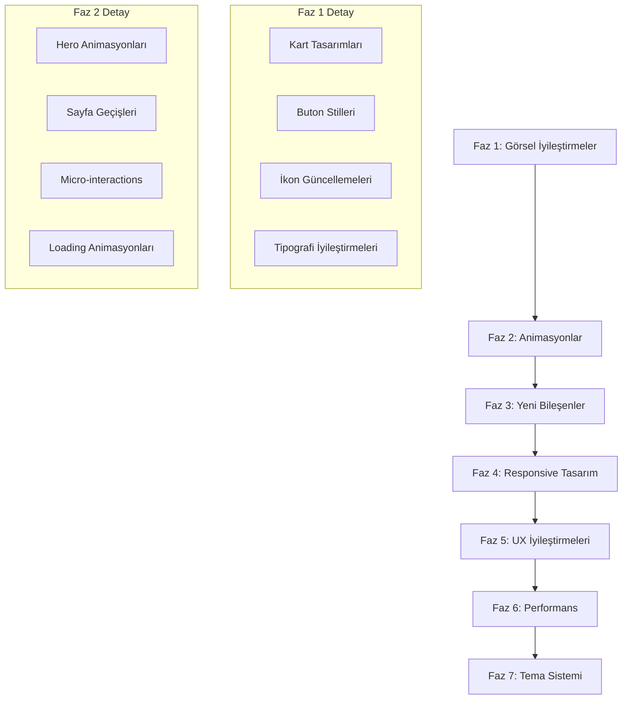
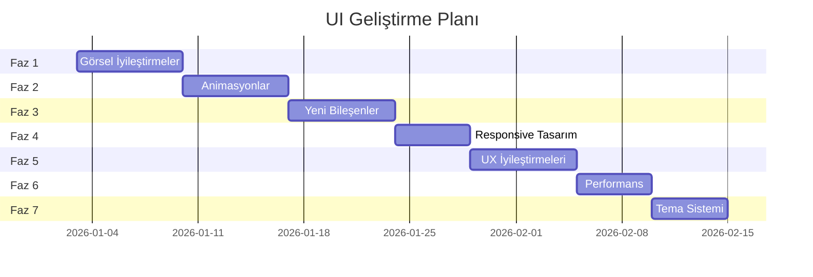

# 🎨 Haber Merkezi - Kapsamlı UI Geliştirme Planı

## 📋 Genel Bakış

Bu plan, Haber Merkezi uygulamasının kullanıcı arayüzünü modernize etmek ve kullanıcı deneyimini iyileştirmek için hazırlanmıştır. Plan 7 ana faz içermektedir.

---

## 🏗️ Mevcut Durum Analizi

### Mevcut UI Bileşenleri
- **20+ Sayfa**: Home, Article Detail, Search, Settings, Favorites, vb.
- **18 Provider**: State management için Riverpod kullanımı
- **Tema Sistemi**: 5 renk teması + dinamik renk desteği
- **Responsive**: Temel tablet/desktop desteği mevcut

### Güçlü Yönler
- Material Design 3 kullanımı
- Dark/Light tema desteği
- Glassmorphism efektleri
- Shimmer loading animasyonları

### İyileştirme Alanları
- Hero animasyonları devre dışı (çakışma sorunu)
- Bazı sayfalar responsive değil
- Empty state tasarımları eksik
- Gesture kontrolleri sınırlı

---

## 📊 UI Geliştirme Akış Diyagramı



---

## 🎯 Faz 1: Görsel İyileştirmeler

### 1.1 Kart Tasarımları
**Dosya:** [`lib/presentation/pages/home/widgets/article_card.dart`](lib/presentation/pages/home/widgets/article_card.dart)

#### Yapılacaklar:
- [ ] Kart gölgelerini iyileştir - daha yumuşak shadow
- [ ] Border radius değerlerini standartlaştır
- [ ] Gradient overlay ekle - görsel üzerinde metin okunabilirliği
- [ ] Hover efektleri ekle - web/desktop için
- [ ] Kart içi spacing optimizasyonu
- [ ] Yeni kart varyantları: Featured Card, Mini Card, Grid Card

#### Kod Örneği:
```dart
// Yeni kart shadow stili
BoxShadow(
  color: Colors.black.withOpacity(0.08),
  blurRadius: 20,
  offset: const Offset(0, 4),
  spreadRadius: 0,
)
```

### 1.2 Buton Stilleri
**Dosya:** [`lib/presentation/themes/app_theme.dart`](lib/presentation/themes/app_theme.dart)

#### Yapılacaklar:
- [ ] Primary, Secondary, Tertiary buton stilleri
- [ ] Icon button varyantları
- [ ] Floating Action Button animasyonları
- [ ] Buton press efektleri - ripple iyileştirmeleri
- [ ] Loading state butonları

### 1.3 İkon Güncellemeleri
#### Yapılacaklar:
- [ ] Tutarlı ikon seti kullanımı
- [ ] Animated ikonlar - favori, bookmark, share
- [ ] Kategori ikonları güncelleme
- [ ] Custom ikon widget oluştur

### 1.4 Tipografi İyileştirmeleri
**Dosya:** [`lib/presentation/themes/app_theme.dart`](lib/presentation/themes/app_theme.dart:414)

#### Yapılacaklar:
- [ ] Başlık hiyerarşisi netleştir
- [ ] Line height optimizasyonu
- [ ] Letter spacing ayarları
- [ ] Font weight tutarlılığı

---

## 🎬 Faz 2: Animasyonlar

### 2.1 Hero Animasyonları
**Sorun:** Mevcut Hero animasyonları çakışma nedeniyle devre dışı

#### Yapılacaklar:
- [ ] Hero tag çakışma sorununu çöz
- [ ] Article Card -> Detail geçişi
- [ ] Image gallery hero animasyonu
- [ ] Shared element transitions

#### Çözüm Yaklaşımı:
```dart
// Unique hero tag oluşturma
Hero(
  tag: 'article-image-${article.id}-${context.hashCode}',
  child: CachedNetworkImage(...),
)
```

### 2.2 Sayfa Geçişleri
#### Yapılacaklar:
- [ ] Custom PageRouteBuilder oluştur
- [ ] Fade + Slide geçişleri
- [ ] Modal bottom sheet animasyonları
- [ ] Navigation rail geçişleri

#### Kod Örneği:
```dart
class SlidePageRoute<T> extends PageRouteBuilder<T> {
  SlidePageRoute({required Widget page})
      : super(
          pageBuilder: (context, animation, secondaryAnimation) => page,
          transitionsBuilder: (context, animation, secondaryAnimation, child) {
            return SlideTransition(
              position: Tween<Offset>(
                begin: const Offset(1.0, 0.0),
                end: Offset.zero,
              ).animate(CurvedAnimation(
                parent: animation,
                curve: Curves.easeOutCubic,
              )),
              child: child,
            );
          },
          transitionDuration: const Duration(milliseconds: 300),
        );
}
```

### 2.3 Micro-interactions
#### Yapılacaklar:
- [ ] Favori butonu kalp animasyonu
- [ ] Bookmark ekleme animasyonu
- [ ] Pull-to-refresh custom animasyonu
- [ ] Tab değişim animasyonları
- [ ] Checkbox/Switch animasyonları
- [ ] Snackbar giriş/çıkış animasyonları

### 2.4 Loading Animasyonları
**Dosya:** [`lib/presentation/widgets/loading/shimmer_loading.dart`](lib/presentation/widgets/loading/shimmer_loading.dart)

#### Yapılacaklar:
- [ ] Skeleton loading iyileştirmeleri
- [ ] Pulse animasyonu alternatifleri
- [ ] Content placeholder varyantları
- [ ] Progressive image loading

---

## 🧩 Faz 3: Yeni Bileşenler

### 3.1 Custom Widget'lar
#### Yapılacaklar:
- [ ] **NewsCarousel**: Yatay kaydırmalı haber slider
- [ ] **CategoryChip**: Animasyonlu kategori seçici
- [ ] **ReadingProgressBar**: Okuma ilerleme göstergesi
- [ ] **ArticleStats**: Görüntülenme, paylaşım istatistikleri
- [ ] **SourceBadge**: Kaynak logosu ve adı
- [ ] **TimeAgoWidget**: Dinamik zaman göstergesi
- [ ] **BookmarkButton**: Animasyonlu bookmark butonu
- [ ] **ShareSheet**: Custom paylaşım bottom sheet

### 3.2 Yeni Sayfa Bileşenleri
#### Yapılacaklar:
- [ ] **StickyHeader**: Scroll ile küçülen header
- [ ] **CollapsibleAppBar**: Genişleyebilir app bar
- [ ] **BottomNavigation**: Custom bottom navigation
- [ ] **SidePanel**: Tablet için yan panel

### 3.3 Dialog ve Modal'lar
**Dosya:** [`lib/presentation/widgets/dialogs/modern_alert_dialog.dart`](lib/presentation/widgets/dialogs/modern_alert_dialog.dart)

#### Yapılacaklar:
- [ ] Confirmation dialog iyileştirmeleri
- [ ] Action sheet tasarımı
- [ ] Filter modal
- [ ] Sort options modal
- [ ] Image preview modal

---

## 📱 Faz 4: Responsive Tasarım

### 4.1 Breakpoint Sistemi
#### Yapılacaklar:
- [ ] Breakpoint sabitleri tanımla
- [ ] ResponsiveBuilder widget oluştur
- [ ] Adaptive layout patterns

#### Breakpoint Tanımları:
```dart
class Breakpoints {
  static const double mobile = 600;
  static const double tablet = 900;
  static const double desktop = 1200;
  static const double largeDesktop = 1800;
}
```

### 4.2 Tablet Optimizasyonu
**Dosya:** [`lib/presentation/pages/home/home_page.dart`](lib/presentation/pages/home/home_page.dart:346)

#### Yapılacaklar:
- [ ] Master-Detail layout iyileştirmeleri
- [ ] Navigation Rail genişletme
- [ ] Grid layout for articles
- [ ] Split view for article detail
- [ ] Landscape mode optimizasyonu

### 4.3 Desktop Optimizasyonu
#### Yapılacaklar:
- [ ] Hover states tüm interaktif elementler için
- [ ] Keyboard navigation
- [ ] Context menu desteği
- [ ] Window resize handling
- [ ] Multi-column layouts

### 4.4 Web Optimizasyonu
#### Yapılacaklar:
- [ ] SEO-friendly yapı
- [ ] PWA desteği iyileştirmeleri
- [ ] Browser-specific styling
- [ ] Responsive images

---

## 🎯 Faz 5: UX İyileştirmeleri

### 5.1 Navigasyon
#### Yapılacaklar:
- [ ] Bottom navigation animasyonları
- [ ] Breadcrumb navigation
- [ ] Back gesture handling
- [ ] Deep linking iyileştirmeleri
- [ ] Navigation history management

### 5.2 Gesture Kontrolleri
#### Yapılacaklar:
- [ ] Swipe to dismiss - favorilerden çıkar
- [ ] Swipe to bookmark
- [ ] Double tap to like
- [ ] Long press context menu
- [ ] Pinch to zoom images
- [ ] Pull to refresh custom

#### Kod Örneği:
```dart
Dismissible(
  key: Key(article.id),
  direction: DismissDirection.horizontal,
  background: _buildSwipeBackground(Icons.favorite, Colors.red),
  secondaryBackground: _buildSwipeBackground(Icons.bookmark, Colors.blue),
  confirmDismiss: (direction) async {
    if (direction == DismissDirection.startToEnd) {
      // Favoriye ekle
      return false; // Dismiss etme, sadece action yap
    } else {
      // Bookmark ekle
      return false;
    }
  },
  child: ArticleCard(...),
)
```

### 5.3 Empty States
#### Yapılacaklar:
- [ ] No articles found state
- [ ] No favorites state
- [ ] No search results state
- [ ] Offline state
- [ ] Error state
- [ ] Loading state variations

#### Empty State Widget:
```dart
class EmptyStateWidget extends StatelessWidget {
  final IconData icon;
  final String title;
  final String description;
  final String? actionText;
  final VoidCallback? onAction;
  
  // Animasyonlu ikon ve metin
}
```

### 5.4 Onboarding İyileştirmeleri
**Dosya:** [`lib/presentation/pages/onboarding/onboarding_page.dart`](lib/presentation/pages/onboarding/onboarding_page.dart)

#### Yapılacaklar:
- [ ] Sayfa geçiş animasyonları
- [ ] Progress indicator
- [ ] Skip/Next butonları
- [ ] İlgi alanı seçimi UI

### 5.5 Feedback Mekanizmaları
#### Yapılacaklar:
- [ ] Haptic feedback tüm butonlar için
- [ ] Success/Error toast mesajları
- [ ] Loading indicators
- [ ] Progress feedback

---

## ⚡ Faz 6: Performans Optimizasyonları

### 6.1 Liste Performansı
**Dosya:** [`lib/presentation/pages/home/widgets/news_list.dart`](lib/presentation/pages/home/widgets/news_list.dart)

#### Yapılacaklar:
- [ ] ListView.builder cacheExtent optimizasyonu
- [ ] AutomaticKeepAlive kullanımı
- [ ] RepaintBoundary ekleme
- [ ] Lazy loading iyileştirmeleri
- [ ] Pagination optimizasyonu

#### Kod Örneği:
```dart
ListView.builder(
  cacheExtent: 500,
  addAutomaticKeepAlives: true,
  addRepaintBoundaries: true,
  itemBuilder: (context, index) {
    return RepaintBoundary(
      child: ArticleCard(article: articles[index]),
    );
  },
)
```

### 6.2 Görsel Optimizasyonu
**Dosya:** [`lib/presentation/widgets/optimized_image.dart`](lib/presentation/widgets/optimized_image.dart)

#### Yapılacaklar:
- [ ] Progressive image loading
- [ ] Blur placeholder
- [ ] Memory cache boyutu optimizasyonu
- [ ] Disk cache stratejisi
- [ ] WebP format desteği
- [ ] Responsive image sizes

### 6.3 State Management Optimizasyonu
#### Yapılacaklar:
- [ ] Riverpod select kullanımı yaygınlaştır
- [ ] Gereksiz rebuild'leri önle
- [ ] Memoization ekle
- [ ] Provider scope optimizasyonu

### 6.4 Build Optimizasyonu
#### Yapılacaklar:
- [ ] const constructor kullanımı
- [ ] Widget extraction
- [ ] Conditional rendering optimizasyonu

---

## 🎨 Faz 7: Tema Sistemi

### 7.1 Yeni Temalar
**Dosya:** [`lib/presentation/themes/app_theme.dart`](lib/presentation/themes/app_theme.dart)

#### Yapılacaklar:
- [ ] **Midnight Blue**: Koyu mavi tema
- [ ] **Forest Green**: Doğal yeşil tema
- [ ] **Sunset Orange**: Sıcak turuncu tema
- [ ] **Rose Pink**: Pembe tema
- [ ] **Monochrome**: Siyah-beyaz tema

### 7.2 Dark Mode İyileştirmeleri
#### Yapılacaklar:
- [ ] OLED black tema seçeneği
- [ ] Kontrast ayarları
- [ ] Gece modu otomatik geçiş
- [ ] Sistem teması senkronizasyonu

### 7.3 Tema Özelleştirme
#### Yapılacaklar:
- [ ] Accent color seçici
- [ ] Font family seçimi
- [ ] Border radius ayarları
- [ ] Tema önizleme

### 7.4 Accessibility
#### Yapılacaklar:
- [ ] High contrast mode
- [ ] Large text support
- [ ] Screen reader optimization
- [ ] Color blind friendly palettes

---

## 📁 Dosya Yapısı Önerisi

```
lib/presentation/
├── widgets/
│   ├── common/
│   │   ├── animated_icon.dart
│   │   ├── custom_button.dart
│   │   ├── gradient_container.dart
│   │   └── responsive_builder.dart
│   ├── cards/
│   │   ├── article_card.dart
│   │   ├── featured_card.dart
│   │   ├── mini_card.dart
│   │   └── grid_card.dart
│   ├── animations/
│   │   ├── fade_animation.dart
│   │   ├── slide_animation.dart
│   │   ├── scale_animation.dart
│   │   └── hero_wrapper.dart
│   ├── empty_states/
│   │   ├── empty_state_widget.dart
│   │   ├── no_articles.dart
│   │   ├── no_favorites.dart
│   │   └── offline_state.dart
│   └── feedback/
│       ├── toast_message.dart
│       ├── loading_overlay.dart
│       └── progress_indicator.dart
├── themes/
│   ├── app_theme.dart
│   ├── color_schemes/
│   │   ├── sage_green.dart
│   │   ├── ocean_blue.dart
│   │   ├── midnight_blue.dart
│   │   └── forest_green.dart
│   └── typography.dart
└── utils/
    ├── responsive_helper.dart
    ├── animation_helper.dart
    └── gesture_helper.dart
```

---

## 🔄 Uygulama Sırası



---

## ✅ Başarı Kriterleri

| Kriter | Hedef |
|--------|-------|
| Animasyon FPS | 60 FPS |
| İlk Render Süresi | < 2 saniye |
| Lighthouse Score | > 90 |
| Accessibility Score | > 95 |
| Kullanıcı Memnuniyeti | > 4.5/5 |

---

## 📝 Notlar

1. Her faz tamamlandığında test edilmeli
2. Performans metrikleri sürekli izlenmeli
3. Kullanıcı geri bildirimleri değerlendirilmeli
4. A/B testleri yapılmalı

---

**Oluşturulma Tarihi:** 2026-01-02
**Son Güncelleme:** 2026-01-02
**Versiyon:** 1.0